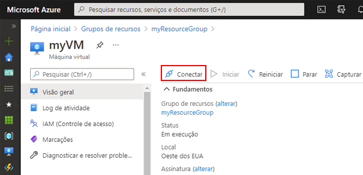
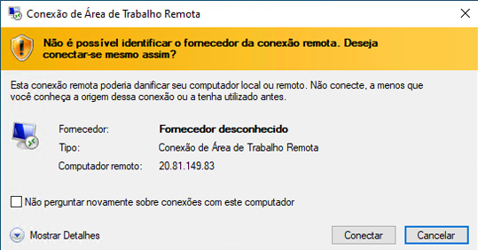
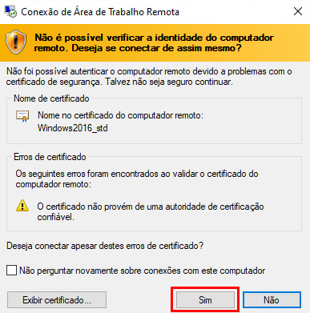
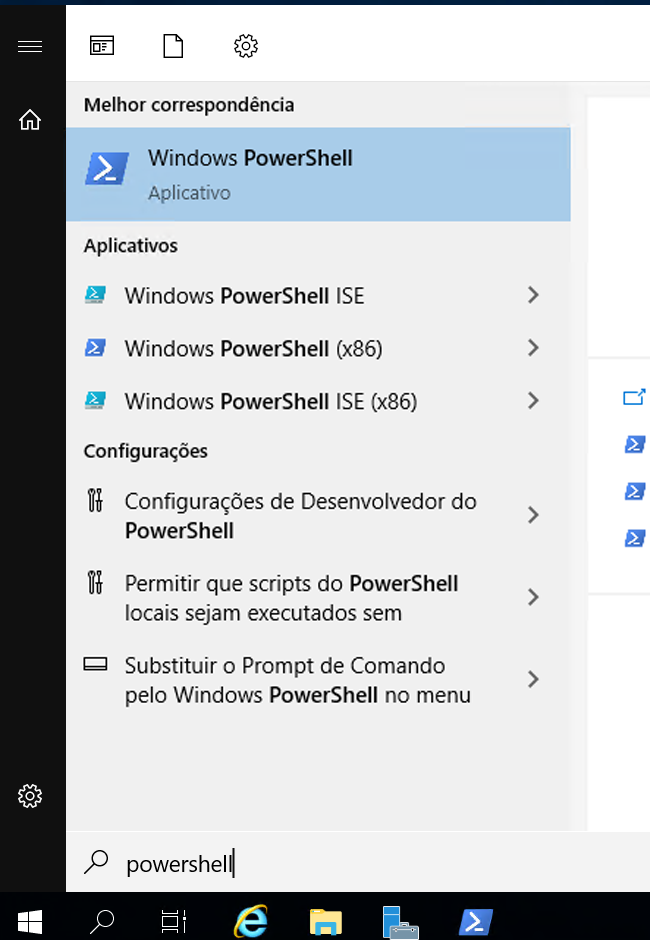
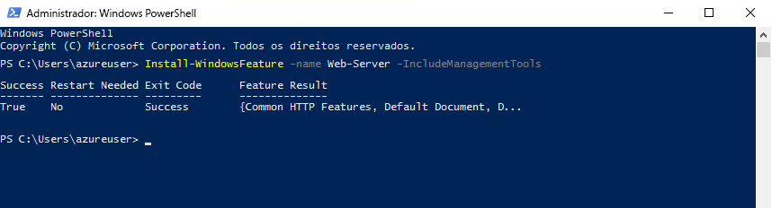
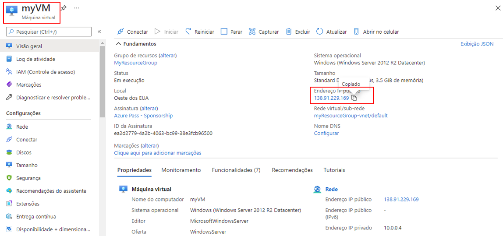
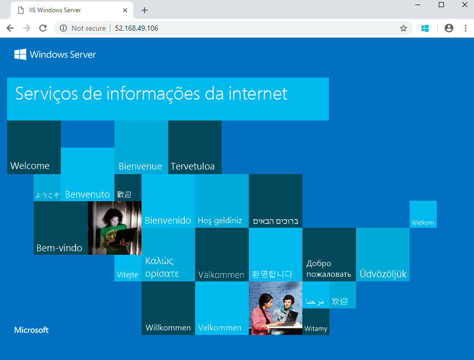

---
wts:
  title: 01 – Criar uma máquina virtual no portal (10 min)
  module: Module 02 - Core Azure Services (Workloads)
---
# <a name="01---create-a-virtual-machine-in-the-portal-10-min"></a>01 – Criar uma máquina virtual no portal (10 min)

Neste passo a passo, criaremos uma máquina virtual no portal do Azure, conectaremos à máquina virtual, instalaremos a função de servidor web e testaremos. 

**Observação**: Reserve um tempo durante este passo a passo para selecionar e ler os ícones informativos. 

# <a name="task-1-create-the-virtual-machine"></a>Tarefa 1: Criar a máquina virtual 
1. Entre no portal do Azure: **https://portal.azure.com**

3. Na folha **Todos os serviços** no Menu do Portal, pesquise e selecione **Máquinas virtuais**, clique em **+Criar** e escolha **+Máquina virtual do Azure** no menu suspenso.

4. Na guia **Básico**, preencha as seguintes informações (mantenha os padrões para todo o resto):

    | Configurações | Valores |
    |  -- | -- |
    | Subscription | **Use a padrão fornecida** |
    | Resource group | **Criar grupo de recursos** |
    | Nome da máquina virtual | **myVM** |
    | Região | **(EUA) Leste dos EUA**|
    | Opções de disponibilidade | Nenhuma opção de redundância de infraestrutura exigida|
    | Image | **Datacenter do Windows Server 2019 – Gen2**|
    | Tamanho | **Standard D2s v3**|
    | Nome de usuário da conta de administrador | **azureuser** |
    | Senha da conta de administrador (digite com atenção!) | **Pa$$w0rd1234**|
    | Regras da porta de entrada - | **Permitir portas selecionadas **|
    | Selecione as portas de entrada | **RDP (3389)** e **HTTP (80)**| 

5. Passe para a guia Rede para verificar se **HTTP (80) e RDP (3389)** estão selecionadas na seção **Selecionar portas de entrada**.

6. Alterne para a guia Gerenciamento e, em sua seção **Monitoring**, selecione a seguinte configuração:

    | Configurações | Valores |
    | -- | -- |
    | Diagnóstico de inicialização | **Desabilitar**|

7. Mantenha os valores restantes padrão e selecione **Revisar + criar** na parte inferior da página.

8. Assim que a validação for aprovada, clique no botão **Criar**. Pode levar de cinco a sete minutos para implantar a máquina virtual.

9. Você vai receber atualizações na página de implantação e por meio da área de **Notificações** (ícone de sino na barra de menu superior).

# <a name="task-2-connect-to-the-virtual-machine"></a>Tarefa 2: Conectar-se à máquina virtual

Nesta tarefa, vamos nos conectar à nova máquina virtual usando RDP (Protocolo de Área de Trabalho Remota). 

1. Clique no ícone de sino na barra de ferramentas superior azul e selecione “Ir para o recurso” quando a implantação for concluída. 

    **Observação**: você também pode usar o link **Ir para o recurso** na página de implantação 

2. Na folha **Visão geral** da máquina virtual, selecione o botão **Conectar** e escolha **RDP** na lista suspensa.

    

    **Observação**: As instruções a seguir mostram como se conectar à VM a partir de um computador Windows. Em um Mac, você precisa de um cliente RDP, como este Remote Desktop Client da Mac App Store; em um computador Linux, você pode usar um cliente RDP de software livre.

2. Na página **Conectar à máquina virtual**, mantenha as opções padrão para se conectar ao endereço IP público na porta 3389 e selecione **Baixar Arquivo RDP**. O arquivo será baixado e aparecerá no canto inferior esquerdo da tela.

3. **Abra** o arquivo RDP baixado (no canto inferior esquerdo da máquina do laboratório) e selecione **Conectar** quando solicitado. 

    

4. Na janela **Segurança do Windows**, entre usando as Credenciais de Administrador usadas ao criar a VM **azureuser** e a senha **Pa$$w0rd1234**. 

5. Você pode receber um aviso de certificação durante o processo de logon. Clique em **Sim** para criar a conexão e se conectar à VM implantada. Você deve se conectar com sucesso.

    

A nova Máquina Virtual (myVM) será iniciada no Laboratório. Feche o Gerenciador do Servidor e a janela pop-up aberta (selecione o “X” no canto superior direito). Deve ser exibido o plano de fundo da sua máquina virtual. **Parabéns!** Você implantou e se conectou à Máquina Virtual executando o Windows Server. 

# <a name="task-3-install-the-web-server-role-and-test"></a>Tarefa 3: Instalar a função de servidor Web e testar

Nesta tarefa, instale a função de Servidor Web no servidor da máquina virtual recém-criada e verifique se a página de boas-vindas padrão do IIS é exibida. 

1. Na máquina virtual que foi aberta, inicie o PowerShell: pesquise **PowerShell** na barra de pesquisa, clique com o botão direito em **Windows PowerShell** e selecione **Executar como administrador**.

    

2. No PowerShell, instale o recurso **Web-Server** na máquina virtual executando o seguinte comando: (Cole o comando e pressione ENTER para que a instalação comece).

    ```PowerShell
    Install-WindowsFeature -name Web-Server -IncludeManagementTools
    ```
  
3. Quando concluído, um prompt vai aparecer informando o **Êxito**, com valor **True**. Você não precisa reiniciar a máquina virtual para concluir a instalação. Feche a conexão do RDP à VM selecionando o **x** na barra azul no centro superior da máquina virtual. Também é possível minimizá-la selecionando **-** na barra azul na parte superior central.

    

4. De volta ao portal, navegue até a folha **Visão geral** da myVM e use o botão **Clique para área de transferência** para copiar o endereço IP público da myVM. Abra uma nova guia do navegador, cole o endereço IP público na caixa de texto URL e pressione a tecla **Enter** para navegar até ele.

    

5. A página de boas-vindas padrão do Servidor Web do IIS será aberta.

    

**Parabéns!** Você criou uma VM executando um servidor Web acessível por meio do endereço IP público. Se você tivesse um aplicativo Web para hospedar, poderia implantar arquivos de aplicativo na máquina virtual e hospedá-los para acesso público na máquina virtual implantada.


**Observação**: Para evitar custos adicionais, você tem a opção de remover este grupo de recursos. Procure grupos de recursos, clique em seu grupo de recursos e, em seguida, clique em **Excluir grupo de recursos**. Verifique o nome do grupo de recursos e clique em **Excluir**. Monitore as **Notificações** para verificar se a exclusão foi concluída com êxito. 
