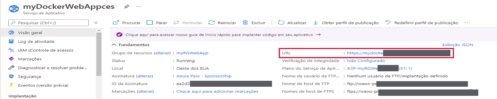
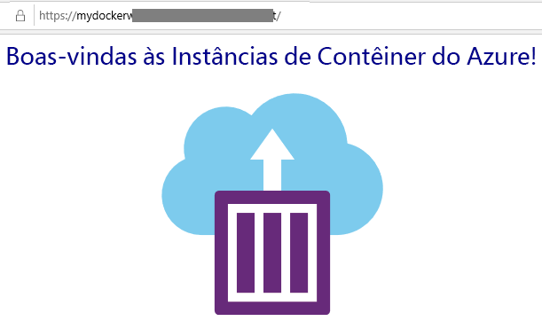

---
wts:
  title: 02 – Criar um Aplicativo Web (10 min)
  module: Module 02 - Core Azure Services (Workloads)
---
# 02 – Criar um Aplicativo Web (10 min)

Neste passo a passo, vamos criar um aplicativo Web que executa um contêiner do Docker. O contêiner do Docker exibe uma mensagem de Boas-Vindas. 

O Serviço de Aplicativo do Azure é, na verdade, uma coleção de quatro serviços compilados para ajudar a hospedar e executar aplicativos Web. Os quatro serviços (aplicativos Web, aplicativos móveis, aplicativos de API e aplicativos lógicos) parecem diferentes, mas no final todos operam de maneiras muito semelhantes. Os aplicativos Web são os mais comumente usados dos quatro serviços, e este é o serviço que usaremos neste laboratório.

# Tarefa 1: Criar um aplicativo Web 

Nesta tarefa, você criará um Aplicativo Web do Serviço de Aplicativo do Azure. 

1. Entre no [portal do Azure](http://portal.azure.com/). 

2. Na folha **Todos os serviços**, procure e selecione **Serviços de Aplicativos** e clique em **+ Adicionar, + Criar, + Novo**

3. Na guia **Básico** da folha **Aplicativo Web**, especifique as seguintes configurações (substitua **xxxx** no nome do aplicativo Web por letras e dígitos de forma que o nome seja exclusivo globalmente). Mantenha os padrões para todo o resto, incluindo o Plano do Serviço de Aplicativo. 

    | Configuração | Valor |
    | -- | -- |
    | Subscription | **Use a padrão fornecida** |
    | Grupo de recursos | **Criar grupo de recursos**|
    | Nome | **myDockerWebAppxxxx** |
    | Publicar | **Contêiner do Docker** |
    | Sistema operacional | **Linux** |
    | Região | **Leste dos EUA** |
    
    **Observação:** Lembre-se de alterar o **xxxx** para que o Aplicativo Web tenha um nome exclusivo.

4. Clique em **Avançar > Docker** e configure as informações do contêiner.  

    | Configuração | Valor |
    | -- | -- |
    | Opções | **Contêiner único** |
    | Origem da imagem | **Docker Hub** |
    | Tipo de acesso | **Público** |
    | Imagem e marca | **mcr.microsoft.com/azuredocs/aci-helloworld** |
    
 **Observação:** O comando de inicialização é opcional e não é necessário neste exercício.

5. Clique em **Revisar + criar** e, em seguida, clique em **Criar**. 

# Tarefa 2: Testar o aplicativo Web

Nesta tarefa, testaremos o aplicativo Web.

1. Aguarde a implantação do aplicativo Web.

2. Em **Notificações**, clique em **Ir para o recurso**. 

3. Na folha **Visão geral**, localize a **URL**. Copie a URL para a área de transferência.

    

4. Abra uma nova guia do navegador, cole a URI e pressione enter. Boas-vindas às Instâncias de Contêiner do Azure! a mensagem de boas-vindas será exibida.

    

5. Volte para a folha **Visão geral** do seu aplicativo Web e role para baixo. Você vai perceber vários gráficos acompanhando a Entrada/Saída de Dados e Solicitações. Ao repetir a etapa 4 algumas vezes, a telemetria correspondente será exibida nos gráficos. Isso inclui o número de solicitações e o tempo médio de resposta. 

**Observação**: Para evitar custos adicionais, você tem a opção de remover este grupo de recursos. Procure grupos de recursos, clique em seu grupo de recursos e, em seguida, clique em **Excluir grupo de recursos**. Verifique o nome do grupo de recursos e clique em **Excluir**. Monitore as **Notificações** para ver como a exclusão está ocorrendo.

Parabéns! Você acaba de criar um Serviço de Aplicativo do Azure com sucesso.
