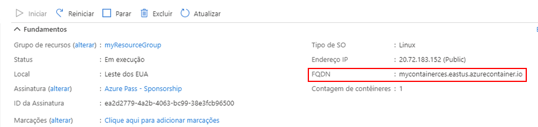
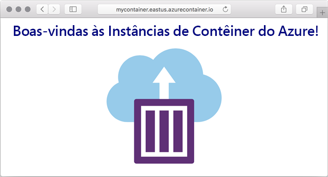

---
wts:
  title: 03 – Implantar Instâncias de Contêiner do Azure (10 min)
  module: Module 02 - Core Azure Services (Workloads)
---

# 03 – Implantar Instâncias de Contêiner do Azure (10 min)

Neste passo a passo, vamos criar, configurar e implantar um contêiner do Docker usando as Instâncias de Contêiner do Azure (ACI) no Portal do Azure. O contêiner é um aplicativo Web de Bem-vindo à ACI que exibe uma página HTML estática. 

# Tarefa 1: Criar uma instância de contêiner 

Nesta tarefa, criaremos uma nova instância de contêiner para o aplicativo Web.  

1. Entre no [portal do Azure](https://portal.azure.com).

2. Na folha **Todos os serviços**, procure e selecione **Instâncias de contêiner** e depois **+ Adicionar, + Criar, + Novo**. 

3. Forneça os seguintes detalhes básicos para a nova instância de contêiner (mantenha os padrões para todo o resto): 

    | Configuração| Valor|
    |----|----|
    | Subscription | ***Use a padrão fornecida*** |
    | Resource group | **Criar grupo de recursos** |
    | Nome do contêiner| **mycontainer**|
    | Região | **(EUA) Leste dos EUA** |
    | Origem da imagem| **Docker Hub ou outro registro**|
    | Tipo de imagem| **Público**|
    | Image| **mcr.microsoft.com/azuredocs/aci-helloworld**|
    | Tipo do SO| **Linux** |
    | Tamanho| ***Mantenha o padrão***|

4. Configure a guia Rede (substitua **xxxx** por letras e dígitos para que o nome seja globalmente exclusivo). Deixe todas as outras configurações com seus valores padrão.

    | Configuração| Valor|
    |--|--|
    | Rótulo do nome DNS| **mycontainerdnsxxxxx** |

    
    **Observação**: Seu contêiner estará publicamente acessível em dns-name-label.region.azurecontainer.io. Se você receber uma mensagem de erro **Etiqueta do nome DNS indisponível** após a implantação, especifique uma etiqueta de nome DNS diferente (não use xxxx) e reimplante. 

5. Clique em **Revisar e criar** para iniciar o processo de validação automática.

6. Clique em **Criar** para criar a instância de contêiner. 

7. Monitore a página de implantação e a página de **Notificações**. 

# Tarefa 2: Verificar a implantação da instância de contêiner

Nesta tarefa, verificamos se a instância de contêiner está em execução, garantindo que a página de boas-vindas seja exibida.

1. Após a conclusão da implantação, clique no link **Ir para o recurso** na folha de implantação ou no link para o recurso na área de Notificação.

2. Na folha **Visão geral** de **mycontainer**, certifique-se de que o **Status** do seu contêiner seja **Em execução**. 

3. Localize o nome de domínio totalmente qualificado (FQDN).

    

2. Copie o FQDN do contêiner em uma nova guia do navegador Web e pressione **Enter**. A página de boas-vindas deve ser exibida. 

    

**Parabéns!** Você usou o Portal do Azure para implantar, com êxito, um aplicativo em contêiner nas Instâncias de Contêiner do Azure.

**Observação**: Para evitar custos adicionais, você tem a opção de remover este grupo de recursos. Procure grupos de recursos, clique em seu grupo de recursos e, em seguida, clique em **Excluir grupo de recursos**. Verifique o nome do grupo de recursos e clique em **Excluir**. Monitore as **Notificações** para ver como a exclusão está ocorrendo.
