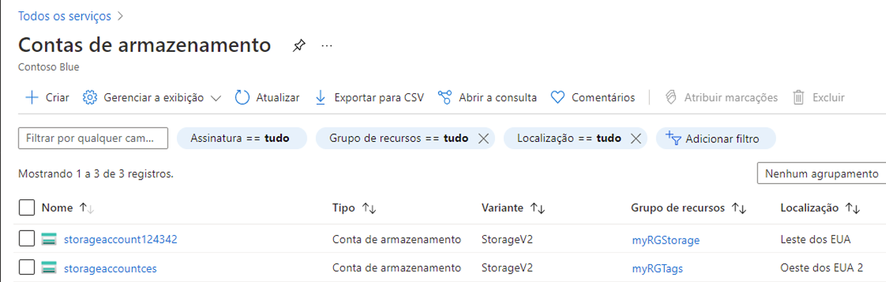
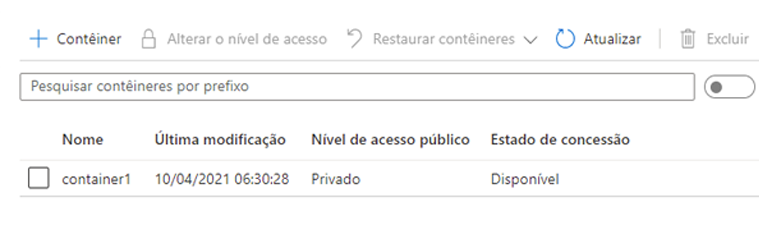
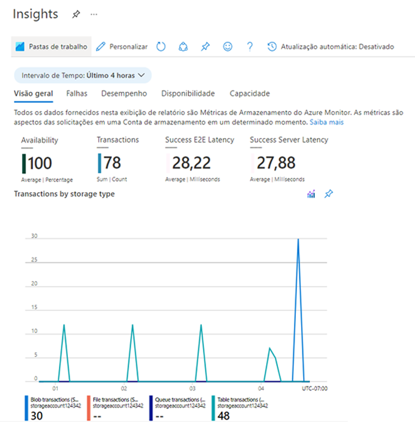

---
wts:
  title: 05 – Criar um armazenamento de blobs (5 min)
  module: Module 02 - Core Azure Services (Workloads)
---
# 05 – Criar um armazenamento de blobs (5 min)

Neste passo a passo, criaremos uma conta de armazenamento e, em seguida, trabalharemos com arquivos de armazenamento de blobs.

# Tarefa 1: Criar uma conta de armazenamento 

Nesta tarefa, criaremos uma nova conta de armazenamento. 

1. Entre no portal do Microsoft Azure em <a href="https://portal.azure.com" target="_blank">https://portal.azure.com</a>

2. Na folha **Todos os serviços**, procure e selecione **Contas de armazenamento** e depois selecione **+ Adicionar, + Criar, + Novo**. 

3. Na guia **Básico** da folha **Criar conta de armazenamento**, preencha as seguintes informações (substitua **xxxx** no nome da conta de armazenamento por letras e dígitos de forma que o nome seja globalmente exclusivo). Mantenha os padrões para todo o resto.

    | Configuração | Valor | 
    | --- | --- |
    | Subscription | **Mantenha a padrão fornecida** |
    | Resource group | **Criar grupo de recursos** |
    | Nome da conta de armazenamento | **storageaccountxxxxx** |
    | Location | **(EUA) Leste dos EUA**  |
    | Desempenho | **Standard** |
    | Redundância | **Armazenamento com redundância local (LRS)** |
    
    **Observação**: lembre-se de alterar o **xxxxx** para que tenha um **Nome de conta de armazenamento** exclusivo

5. Clique em **Revisar + Criar** para revisar as configurações da sua conta de armazenamento e permitir que o Azure valide a configuração. 

6. Depois de validado, clique em **Criar**. Aguarde a notificação de que a conta foi criada com sucesso. 

7. Na página inicial, procure e selecione **Contas de armazenamento** e certifique-se de que sua nova conta de armazenamento esteja listada.

    

# Tarefa 2: Trabalhar com armazenamento de blobs

Nesta tarefa, criaremos um contêiner de blob e carregaremos um arquivo de blob. 

1. Selecione o nome da nova conta de armazenamento, role até a seção **Armazenamento de dados** e, em seguida, selecione **Contêineres**.

2. Clique em **+ Contêiner** e preencha as informações. Use os ícones de informações para saber mais. Quando terminar, clique em **criar**.

    | Configuração | Valor |
    | --- | --- |
    | Nome | **container1**  |
    | Nível de acesso público| **Privado (sem acesso anônimo)** |
  

    

4. Abra uma nova janela no navegador e use o **Bing** para pesquisar imagens de flor. Clique com o botão direito em uma imagem para salvá-la na VM. 

6. De volta ao Portal, selecione **contêiner1** e depois **Carregar**.

5. Pesquise o arquivo de imagem que você acabou de salvar no seu computador. Selecione-a e depois carregue.

   
6. Clique na seta **Avançado**, deixe os valores padrão, mas revise as opções disponíveis e clique em **Carregar**.

    **Observação**: Você pode carregar quantos blobs quiser dessa maneira. Novos blobs serão listados no contêiner.

7. Assim que for carregado, clique com o botão direito do mouse no arquivo e observe as opções, incluindo Exibir/Editar, Baixar, Propriedades e Excluir. 

8. Se tiver tempo, revise as opções para Arquivos, Tabelas e Filas.

# Tarefa 3: Monitorar a conta de armazenamento

1. Volte para a folha da conta de armazenamento e selecione **Diagnosticar e resolver problemas**. 

2. Explore alguns dos problemas de armazenamento mais comuns. Observe que há vários solucionadores de problemas.

3. Na folha da conta de armazenamento, role para baixo até a seção **Monitoramento** e clique em **Insights**. Observe que há informações sobre Falhas, Desempenho, Disponibilidade e Capacidade. Suas informações serão diferentes.

    

Parabéns! Você criou uma conta de armazenamento e, em seguida, trabalhou com blobs de armazenamento.

**Observação**: Para evitar custos adicionais, você tem a opção de remover este grupo de recursos. Procure grupos de recursos, clique em seu grupo de recursos e, em seguida, clique em **Excluir grupo de recursos**. Verifique o nome do grupo de recursos e clique em **Excluir**. Monitore as **Notificações** para ver como a exclusão está ocorrendo.
