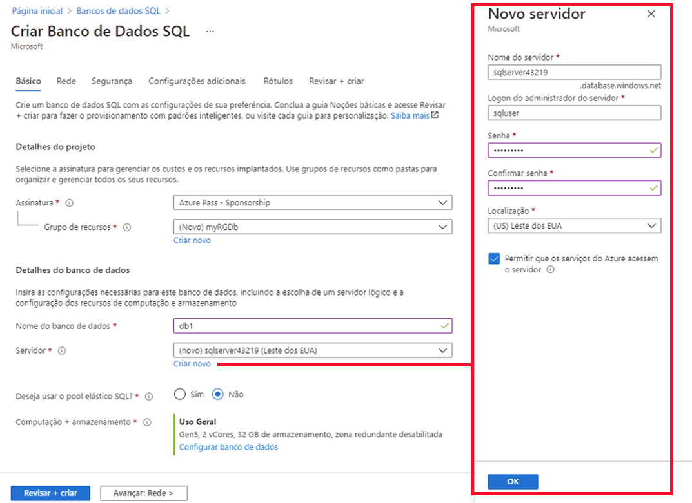
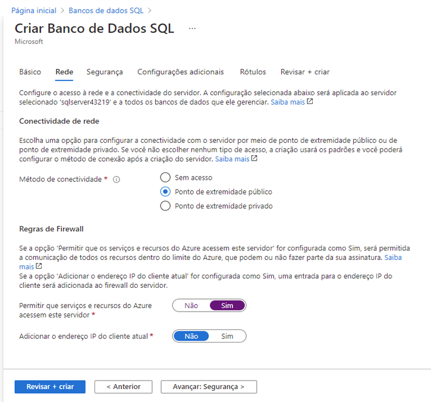
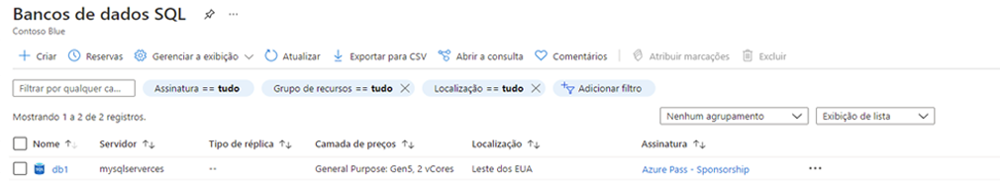
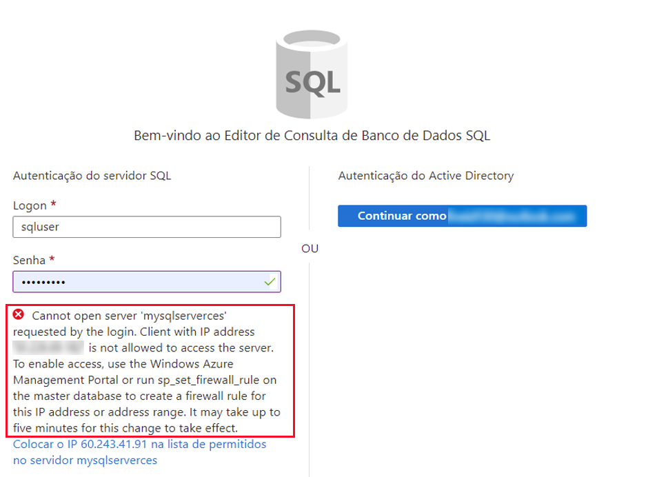
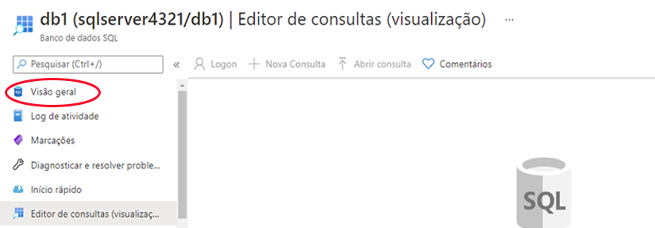
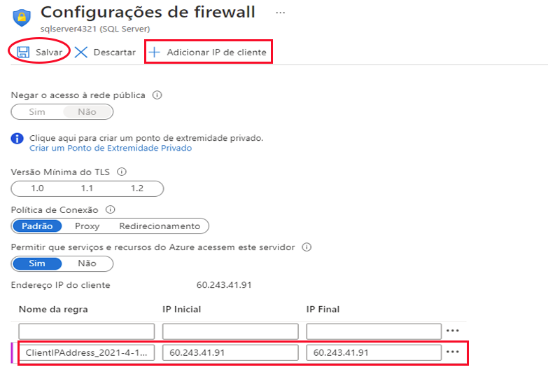
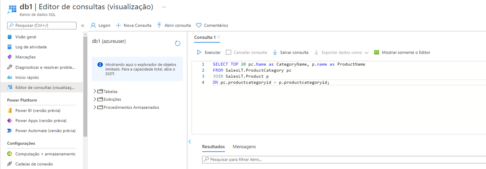
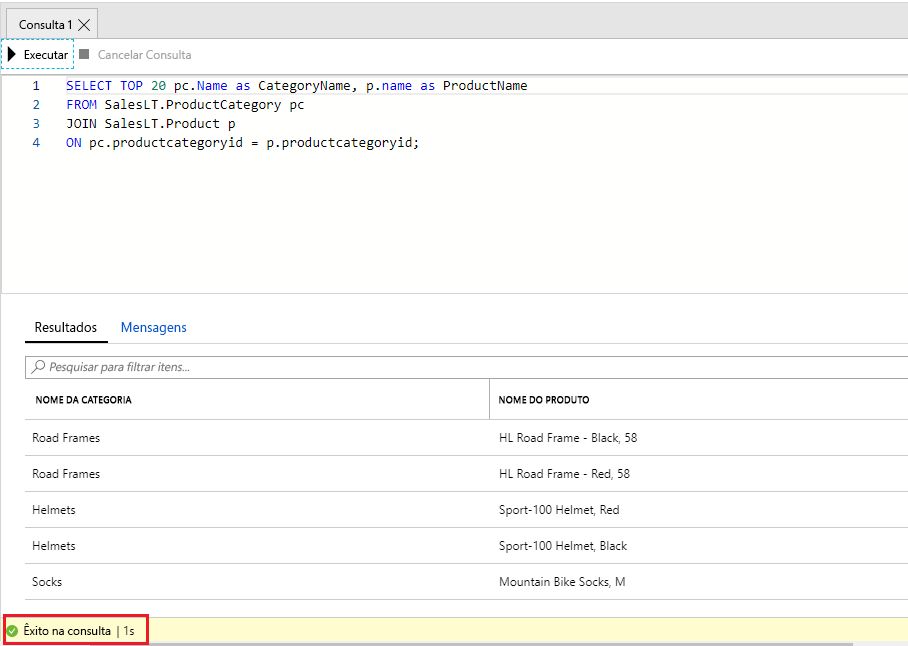

---
wts:
  title: 06 – Criar um banco de dados SQL (5 min)
  module: Module 02 - Core Azure Services (Workloads)
---

# <a name="06---create-a-sql-database-5-min"></a>06 – Criar um banco de dados SQL (5 min)

Neste passo a passo, vamos criar um banco de dados SQL no Azure e depois consultar os dados nesse banco de dados.

# <a name="task-1-create-the-database"></a>Tarefa 1: Criar o banco de dados 

Nesta tarefa, criaremos um banco de dados SQL baseado no banco de dados de exemplo AdventureWorksLT. 

1. Entre no portal do Microsoft Azure em [ **https://portal.azure.com** ](https://portal.azure.com).

2. Na folha **Todos os serviços**, procure e selecione **Bancos de dados SQL** e depois selecione **+ Adicionar, + Criar, + Novo**. 

3. Na guia **Básico**, preencha essas informações.  

    | Configuração | Valor | 
    | --- | --- |
    | Subscription | **Use a padrão fornecida** |
    | Resource group | **Criar grupo de recursos** |
    | Nome do banco de dados| **db1** | 
    | Servidor | Selecione **Criar novo** (Uma nova barra lateral será aberta à direita)|
    | Nome do servidor | **sqlserverxxxx** (deve ser exclusivo) | 
    | Location | **(EUA) Leste dos EUA** |
    | Método de autenticação | **Use Autenticação SQL** |
    | Logon de administrador do servidor | **sqluser** |
    | Senha | **Pa$$w0rd1234** |
    | Clique  | **OK** |

   

4. Na guia **Rede**, defina as configurações a seguir (deixe os outros campos com os valores padrão) 

    | Configuração | Valor | 
    | --- | --- |
    | Método de conectividade | **Ponto de extremidade público** |    
    | Permitir que serviços e recursos do Azure acessem este servidor | **Sim** |
    | Adicionar endereço IP atual do cliente | **Não** |
    
   

5. Na guia **Segurança**. 

    | Configuração | Valor | 
    | --- | --- |
    | Microsoft Defender para SQL| **Agora não** |
    
6. Vá para a guia **Configurações adicionais**. Usaremos o banco de dados de amostra AdventureWorksLT.

    | Configuração | Valor | 
    | --- | --- |
    | Usar dados existentes | **Amostra** |

    

7. Clique em **Revisar + criar** e selecione **Criar** para implantar e provisionar o grupo de recursos, o servidor e o banco de dados. Pode demorar aprox. 2 a 5 minutos para implantar.


# <a name="task-2-test-the-database"></a>Tarefa 2: Testar o banco de dados.

Nesta tarefa, vamos configurar o SQL Server e executar uma consulta SQL. 

1. Quando a implantação for concluída, selecione Ir para o recurso na folha de implantação. Se preferir, na folha **Todos os serviços**, procure e selecione **Bancos de Dados** e depois **Bancos de dados SQL**; verifique se o novo banco de dados foi criado. Talvez seja necessário **Atualizar** a página.

    

2. Selecione a entrada **db1** representando o banco de dados SQL criado. Na folha db1, selecione **Editor de Consultas (pré-visualização)** .

3. Faça logon como **sqluser** com a senha **Pa$$w0rd1234**.

4. Você não conseguirá fazer logon. Leia o erro com atenção e anote o endereço IP que precisa receber permissão para atravessar o firewall. 

    

5. De volta à folha **db1**, selecione **Visão geral**. 

    

6. Na folha **Visão geral** do db1, selecione **Definir firewall do servidor** no centro superior da tela.

7. Selecione **+ Adicionar IP do cliente** (barra de menu superior) para adicionar o endereço IP mencionado no erro. (ele deve ser preenchido automaticamente; caso não seja, cole-o nos campos do endereço IP). Não se esqueça de **Salvar** suas alterações. 

    

8. Volte ao banco de dados SQL (deslizar para a esquerda na barra de alternância na parte inferior) e selecione **Editor de Consultas (Pré-visualização)** . Tente fazer logon como **sqluser** com a senha **Pa$$w0rd1234**. Desta vez, você deve conseguir. Observe que pode demorar alguns minutos para que a nova regra de firewall seja implantada. 

9. Quando entrar, o painel de consulta será exibido. Insira a consulta a seguir no painel do editor. 

    ```SQL
    SELECT TOP 20 pc.Name as CategoryName, p.name as ProductName
    FROM SalesLT.ProductCategory pc
    JOIN SalesLT.Product p
    ON pc.productcategoryid = p.productcategoryid;
    ```

    

10. Clique em **Executar** e examine os resultados da consulta no painel **Resultados**. A consulta deve ser executada com êxito.

    

Parabéns! Você criou um banco de dados SQL no Azure e consultou com êxito os dados contidos nele.

**Observação**: Para evitar custos adicionais, você tem a opção de remover este grupo de recursos. Procure grupos de recursos, clique em seu grupo de recursos e, em seguida, clique em **Excluir grupo de recursos**. Verifique o nome do grupo de recursos e clique em **Excluir**. Monitore as **Notificações** para ver como a exclusão está ocorrendo.
