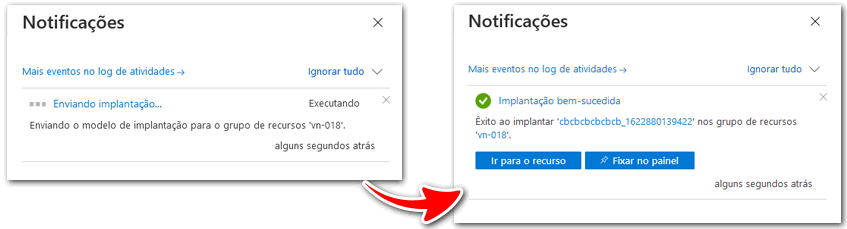
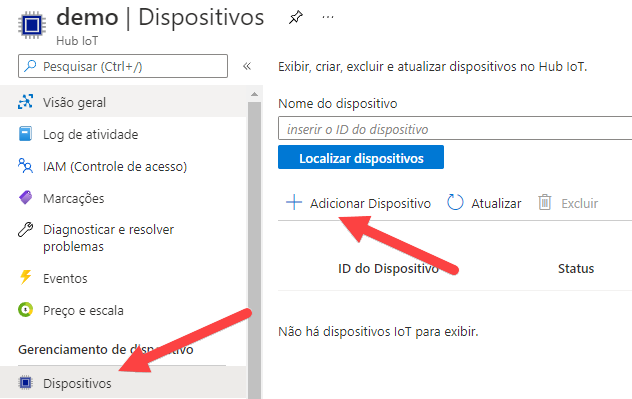
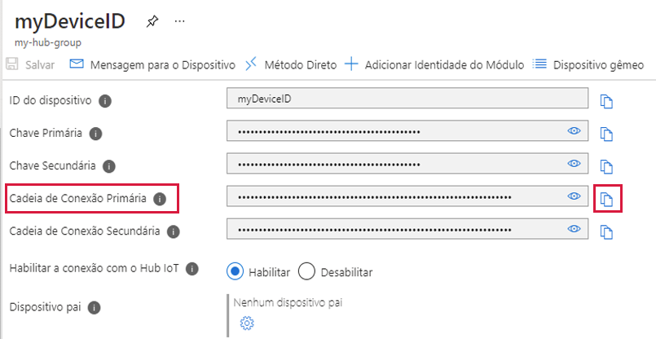
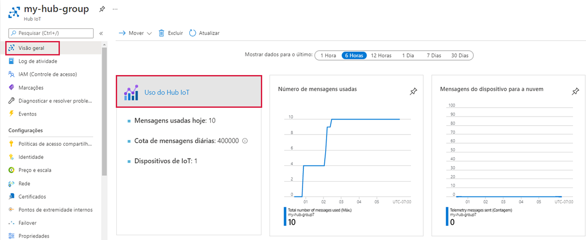

---
wts:
  title: 07 – Implementar um Hub IoT do Azure (10 min)
  module: 'Module 03: Describe core solutions and management tools'
---
# 07 – Implementar um Hub IoT do Azure (10 min)

Neste passo a passo, vamos configurar um novo Hub IoT do Azure no portal do Azure e, em seguida, autenticar uma conexão a um dispositivo IoT usando o simulador de dispositivo Raspberry Pi online. Os dados e mensagens do sensor são transmitidos do simulador Raspberry Pi para o Hub IoT do Azure, e você visualiza as métricas para a atividade de mensagens no portal do Azure.

# Tarefa 1: Criar um hub IoT 

Nesta tarefa, criaremos um hub IoT. 

1. Entre no [portal do Azure](https://portal.azure.com).

2. Na folha **Todos os serviços**, procure e selecione **Hub IoT** e depois selecione **+ Adicionar, + Criar, + Novo**.

3. Na guia **Básico** da folha **Hub IoT**, preencha os campos com os seguintes detalhes (substitua **xxxx** no nome da conta de armazenamento por letras e dígitos de forma que o nome seja globalmente exclusivo):

    | Configurações | Valor |
    |--|--|
    | Subscription | **Manter o padrão fornecido** |
    | Grupo de recursos | **Criar grupo de recursos** |
    | Nome do Hub IoT | **my-hub-groupxxxxx** |
    | Região | **Leste dos EUA** |

    **Observação**Lembre-se de alterar o **xxxxx** para ter um **Nome do Hub IoT** exclusivo.

4. Vá para a guia **Gerenciamento** e use a lista suspensa para definir o **Preço e o nível de escala** como **S1: Camada Standard**.

5. Clique no botão **Examinar + criar**.

6. Clique no botão **Criar** para começar a criar sua nova instância do Hub IoT do Azure.

7. Aguarde até que a instância do Hub IoT do Azure seja implantada. 

# Tarefa 2: Adicionar um dispositivo IoT

Nesta tarefa, adicionaremos um dispositivo IoT ao Hub IoT. 

1. Quando a implantação for concluída, clique em **Ir para o recurso** na folha de implantação. Como alternativa, na folha **Todos os serviços**, procure e selecione **Hub do IoT** e localize sua nova instância do Hub IoT

    

2. Para adicionar um novo dispositivo IoT, role para baixo até a seção **Gerenciamento de dispositivos** e clique em **Dispositivos**. Em seguida, clique em **+Adicionar dispositivo**.

    

3. Forneça um nome para seu novo dispositivo IoT, **myRaspberryPi**, e clique no botão **Salvar**. Isso criará uma nova identidade do dispositivo IoT em seu Hub IoT do Azure.

4. Caso não veja seu novo dispositivo, **Atualize** a página Dispositivos IoT. 

5. Selecione **myRaspberryPi** e copie o valor da **Cadeia de conexão primária**. Você usará essa chave na próxima tarefa para autenticar uma conexão com o simulador Raspberry Pi.

    

# Tarefa 3: Testar o dispositivo usando o Simulador Raspberry Pi

Nesta tarefa, testaremos nosso dispositivo usando o Simulador Raspberry Pi. 

1. Abra uma nova guia no navegador da Web e insira o link https://aka.ms/RaspPi. Ele vai nos levar ao site do Simulador Raspberry Pi. Se tiver tempo, leia sobre o simulador Raspberry Pi. Quando terminar, selecione "**X**" para fechar a janela pop-up.

2. Na área de código, do lado direito, encontre a linha com 'const connectionString ='. Substitua-a pela cadeia de conexão que você copiou do portal do Azure. Observe que a cadeia de conexão inclui as entradas DeviceId (**myRaspberryPi**) e SharedAccessKey.

    

3. Clique em **Executar** (abaixo da área de código) para executar o aplicativo. A saída do console deve mostrar os dados do sensor e as mensagens enviadas do simulador Raspberry Pi para o Hub IoT do Azure. Dados e mensagens são enviados sempre que o LED do simulador Raspberry Pi pisca. 

    

5. Clique em **Parar** para parar de enviar dados.

6. Retorne ao portal do Azure.

7. Alterne a folha **Visão geral** do Hub IoT e role para baixo até as informações de **Uso do Hub IoT**. Em **mostrar dados a partir de**, altere o período para exibir os dados da última hora.

    

Parabéns! Você configurou o Hub IoT do Azure para coletar dados do sensor de um dispositivo IoT.

**Observação**: Para evitar custos adicionais, você tem a opção de remover este grupo de recursos. Procure grupos de recursos, clique em seu grupo de recursos e, em seguida, clique em **Excluir grupo de recursos**. Verifique o nome do grupo de recursos e clique em **Excluir**. Monitore as **Notificações** para ver como a exclusão está ocorrendo.
