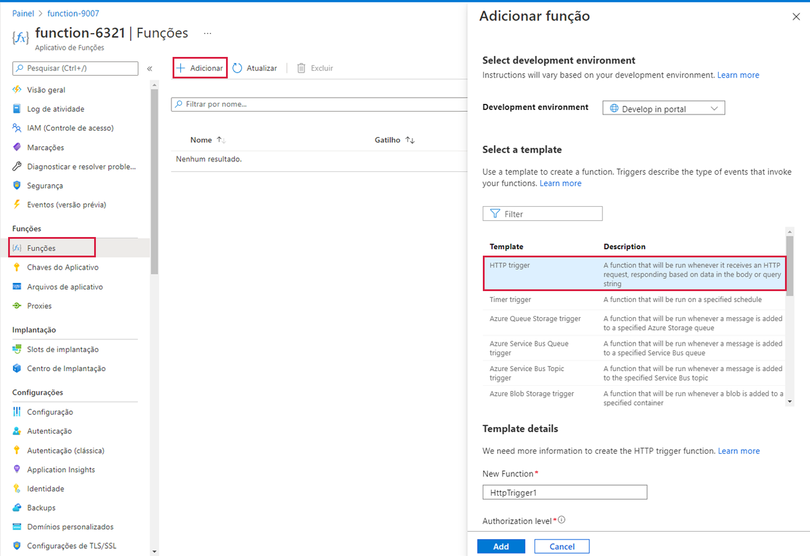

---
wts:
  title: 08 – Implementar Funções do Azure (5 min)
  module: 'Module 03: Describe core solutions and management tools'
---
# 08 – Implementar Funções do Azure (5 min)

Neste passo a passo, criaremos um aplicativo de funções para exibir uma mensagem Olá quando houver uma solicitação HTTP. 

# Tarefa 1: Criar um aplicativo de funções 

Nesta tarefa, criaremos um aplicativo de funções.

1. Entre no [portal do Azure](https://portal.azure.com).

2. Na barra **Pesquisar** na parte superior do portal, pesquise e selecione **Aplicativo de Funções** e, na folha **Aplicativo de Funções**, clique em **+ Adicionar, + Criar, + Novo.**

3. Na guia **Básico** da folha do **Aplicativo de Funções**, especifique as seguintes configurações (substitua **xxxx** no nome da função por letras e dígitos de forma que o nome seja globalmente exclusivo e mantenha todas as outras configurações com seus valores padrão): 

    | Configurações | Valor |
    | -- | --|
    | Subscription | **Manter o padrão fornecido** |
    | Resource group | **Criar grupo de recursos** |
    | Nome do aplicativo de funções | **function-xxxx** |
    | Publicação | **Código** |
    | Pilha de runtime | **.NET** |
    | Versão | **3.1** |
    | Região | **Leste dos EUA** |

    **Observação**Lembre-se de alterar o **xxxx** para que tenha um **Nome de aplicativo de funções** exclusivo

4. Clique em **Revisar + Criar** e, após a validação bem-sucedida, clique em **Criar** para começar a provisionar e implantar seu novo Aplicativo de Funções do Azure.

5. Aguarde a notificação de que o recurso foi criado.

6. When the deployment has completed, click Go to resource from the deployment blade. Alternatively, navigate back to the <bpt id="p1">**</bpt>Function App<ept id="p1">**</ept> blade, click <bpt id="p2">**</bpt>Refresh<ept id="p2">**</ept> and verify that the newly created function app has the <bpt id="p3">**</bpt>Running<ept id="p3">**</ept> status. 

    

# Tarefa 2: Criar uma função disparada por HTTP e testar

Nesta tarefa, usaremos a função Webhook + API para exibir uma mensagem quando houver uma solicitação HTTP. 

1. Na folha **Aplicativo de Funções**, clique no aplicativo de funções recém-criado. 

2. Na folha do aplicativo de funções, na seção **Funções**, clique em **Funções** e depois em **+ Adicionar, + Criar, + Novo**.

    

3. An <bpt id="p1">**</bpt>Add function<ept id="p1">**</ept> pop-up window will appear on the right. In the <bpt id="p1">**</bpt>Select a template<ept id="p1">**</ept> section click <bpt id="p2">**</bpt>HTTP trigger<ept id="p2">**</ept>. Click <bpt id="p1">**</bpt>Add<ept id="p1">**</ept> 

    

4. Na folha **HttpTrigger1**, na seção **Desenvolvedor**, clique em **Código + Teste**. 

5. On the <bpt id="p1">**</bpt>Code + Test<ept id="p1">**</ept> blade, review the auto-generated code and note that the code is designed to run an HTTP request and log information. Also, notice the function returns a Hello message with a name. 

    

6. Clique em **Obter URL de função** na seção superior do editor de função. 

7. Certifique-se de que o valor na lista suspensa **Chave** esteja definido como **padrão** e clique em **Copiar** para copiar o URL da função. 

    

8. Open a new browser tab and paste the copied function URL into your web browser's address bar. When the page is requested the function will run. Notice the returned message stating that the function requires a name in the request body.

    

9. Acrescente **&name=*yourname*** ao final do URL.

    **Observação**: Por exemplo, se o seu nome for Cindy, o URL final será semelhante a: `https://azfuncxxx.azurewebsites.net/api/HttpTrigger1?code=X9xx9999xXXXXX9x9xxxXX==&name=cindy`

    

10. When you hit enter, your function runs and every invocation is traced. To view the traces, return to the Portal <bpt id="p1">**</bpt>HttpTrigger1 <ph id="ph1">\|</ph> Code + Test<ept id="p1">**</ept> blade and click <bpt id="p2">**</bpt>Monitor<ept id="p2">**</ept>. You can <bpt id="p1">**</bpt>configure<ept id="p1">**</ept> Application Insights by selecting the timestamp and click <bpt id="p2">**</bpt>Run query in Application Insights<ept id="p2">**</ept>.

     

Congratulations! You have created a Function App to display a Hello message when there is an HTTP request.  

<bpt id="p1">**</bpt>Note<ept id="p1">**</ept>: To avoid additional costs, you can optionally remove this resource group. Search for resource groups, click your resource group, and then click <bpt id="p1">**</bpt>Delete resource group<ept id="p1">**</ept>. Verify the name of the resource group and then click <bpt id="p1">**</bpt>Delete<ept id="p1">**</ept>. Monitor the <bpt id="p1">**</bpt>Notifications<ept id="p1">**</ept> to see how the delete is proceeding.
