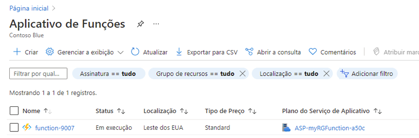
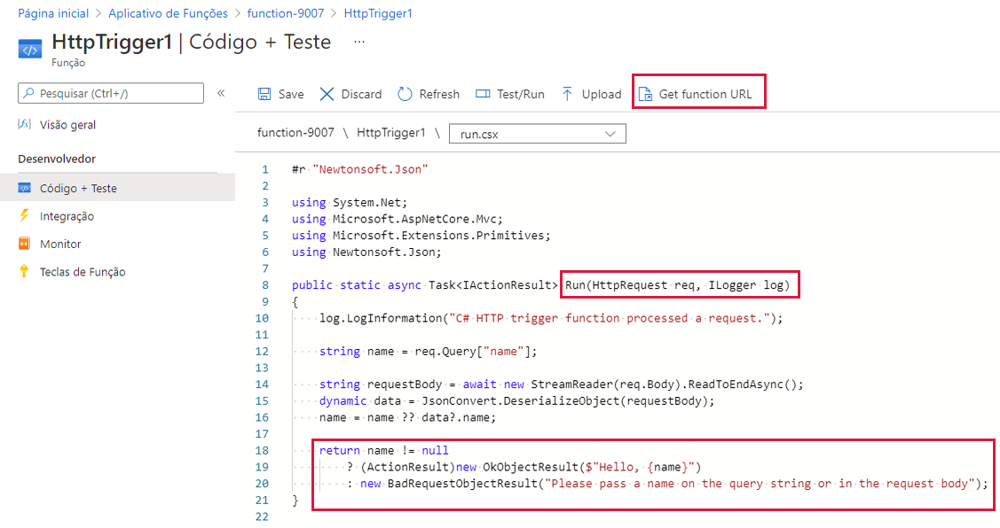
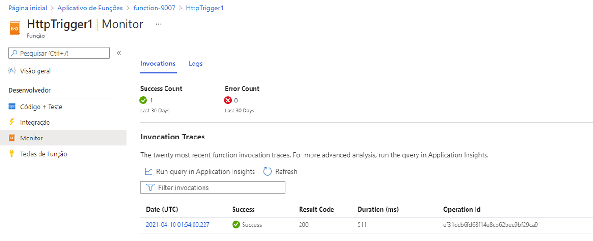

---
wts:
  title: 08 – Implementar Funções do Azure (5 min)
  module: 'Module 03: Describe core solutions and management tools'
---
# 08 – Implementar Funções do Azure (5 min)

Neste passo a passo, criaremos um aplicativo de funções para exibir uma mensagem Olá quando houver uma solicitação HTTP. 

# Tarefa 1: Criar um aplicativo de funções 

Nesta tarefa, criaremos um aplicativo de funções.

1. Entre no [portal do Azure](https://portal.azure.com).

2. Na barra **Pesquisar** na parte superior do portal, pesquise e selecione **Aplicativo de Funções** e, na folha **Aplicativo de Funções**, clique em **+ Adicionar, + Criar, + Novo.**

3. Na guia **Básico** da folha do **Aplicativo de Funções**, especifique as seguintes configurações (substitua **xxxx** no nome da função por letras e dígitos de forma que o nome seja globalmente exclusivo e mantenha todas as outras configurações com seus valores padrão): 

    | Configurações | Valor |
    | -- | --|
    | Subscription | **Manter o padrão fornecido** |
    | Resource group | **Criar grupo de recursos** |
    | Nome do aplicativo de funções | **function-xxxx** |
    | Publicação | **Código** |
    | Pilha de runtime | **.NET** |
    | Versão | **3.1** |
    | Região | **Leste dos EUA** |

    **Observação**Lembre-se de alterar o **xxxx** para que tenha um **Nome de aplicativo de funções** exclusivo

4. Clique em **Revisar + Criar** e, após a validação bem-sucedida, clique em **Criar** para começar a provisionar e implantar seu novo Aplicativo de Funções do Azure.

5. Aguarde a notificação de que o recurso foi criado.

6. Quando a implantação for concluída, selecione Ir para o recurso na folha de implantação. Se preferir, navegue de volta para a folha **Aplicativo de Funções**, selecione **Atualizar** e verifique se o status do aplicativo de funções recém-criado é **Em execução**. 

    

# Tarefa 2: Criar uma função disparada por HTTP e testar

Nesta tarefa, usaremos a função Webhook + API para exibir uma mensagem quando houver uma solicitação HTTP. 

1. Na folha **Aplicativo de Funções**, clique no aplicativo de funções recém-criado. 

2. Na folha do aplicativo de funções, na seção **Funções**, clique em **Funções** e depois em **+ Adicionar, + Criar, + Novo**.

    

3. Uma janela pop-up para **Adicionar função** será exibida à direita. Na seção **Selecionar modelo**, escolha **Gatilho HTTP**. Clique em **Adicionar** 

    

4. Na folha **HttpTrigger1**, na seção **Desenvolvedor**, clique em **Código + Teste**. 

5. Na folha **Código + Teste**, analise o código gerado automaticamente e observe que ele foi desenvolvido para executar uma solicitação HTTP e registrar informações. Além disso, observe que a função responde com uma mensagem de Olá, com um nome. 

    

6. Clique em **Obter URL de função** na seção superior do editor de função. 

7. Certifique-se de que o valor na lista suspensa **Chave** esteja definido como **padrão** e clique em **Copiar** para copiar o URL da função. 

    

8. Abra uma nova guia do navegador e cole o URL da função copiado na barra de endereços do seu navegador Web. Quando a página for solicitada, a função será executada. Observe a mensagem retornada informando que a função requer um nome no corpo da solicitação.

    

9. Acrescente **&name=*yourname*** ao final do URL.

    **Observação**: Por exemplo, se o seu nome for Cindy, o URL final será semelhante a: `https://azfuncxxx.azurewebsites.net/api/HttpTrigger1?code=X9xx9999xXXXXX9x9xxxXX==&name=cindy`

    

10. Ao pressionar o enter, sua função é executada e todas as invocações são rastreadas. Para exibir os rastreamentos, retorne para a folha Portal **HttpTrigger1 \| Código + Teste** e clique em **Monitorar**. Você pode **configurar** o Application Insights selecionando o carimbo de data/hora e clicando em **Executar consulta no Application Insights**.

     

Parabéns! Você criou um aplicativo de funções para exibir uma mensagem Olá quando houver uma solicitação HTTP.  

**Observação**: Para evitar custos adicionais, você tem a opção de remover este grupo de recursos. Procure grupos de recursos, clique em seu grupo de recursos e, em seguida, clique em **Excluir grupo de recursos**. Verifique o nome do grupo de recursos e clique em **Excluir**. Monitore as **Notificações** para ver como a exclusão está ocorrendo.
