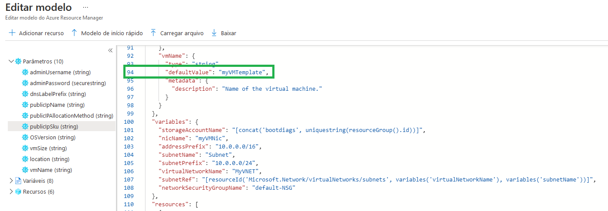
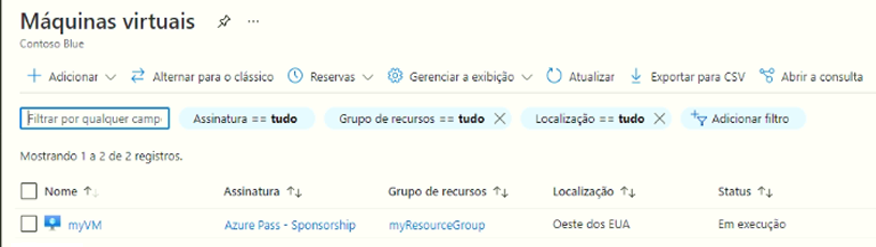
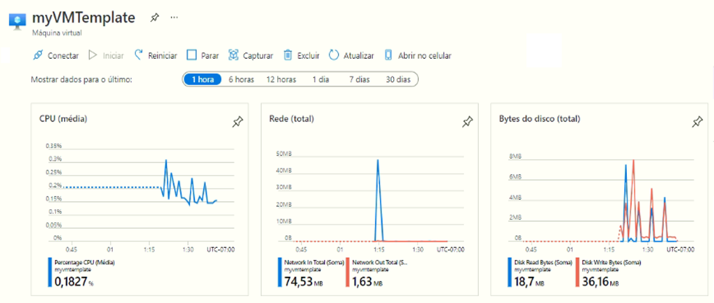
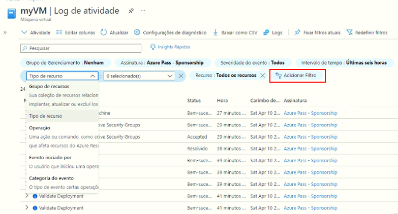

---
wts:
  title: 09 – Criar VM com um Modelo (10 min)
  module: 'Module 03: Describe core solutions and management tools'
---
# 09 – Criar VM com um Modelo (10 min)

Neste passo a passo, implantaremos uma máquina virtual com um modelo de início rápido e examinaremos os recursos de monitoramento.

# Tarefa 1: Explorar a galeria de Início Rápido e encontrar um modelo 

Nesta tarefa, navegaremos na galeria de início rápido do Azure e implantaremos um modelo que cria uma máquina virtual. 

1. No ambiente de laboratório, abra uma nova janela do navegador e digite T https://azure.microsoft.com/en-us/resources/templates/?azure-portal=true. Na galeria, você encontrará vários modelos populares e atualizados recentemente. Esses modelos automatizam a implantação de recursos do Azure, incluindo a instalação de pacotes de software populares. Navegue pelos diversos tipos de modelos disponíveis.

3. Selecione **Implantar VM simples do Windows**

4. Clique no botão **Implantar no Azure**. A sessão do seu navegador será redirecionada automaticamente para o [portal do Azure](http://portal.azure.com/).

  **Observação**: O botão **Implantar no Azure** permite que você implante o modelo por meio do portal do Azure. Durante essa implantação, será solicitado apenas um pequeno conjunto de parâmetros de configuração. 

5. Quando solicitado, entre em sua assinatura do Azure usando as credenciais fornecidas anteriormente nas instruções.

6. Clique em **Editar modelo**. O formato de modelo do Resource Manager usa o formato JSON. Revise os parâmetros e variáveis.  Em seguida, localize o parâmetro para o nome da máquina virtual. Altere o nome para **myVMTemplate**. **Salve** suas alterações. 

    

7. Agora configure os parâmetros exigidos pelo modelo (substitua ***xxxx*** no prefixo da etiqueta de DNS por letras e dígitos para que a etiqueta seja globalmente exclusiva). Mantenha os padrões para todo o resto. 

    | Configuração| Valor|
    |----|----|
    | Subscription | **Manter o padrão fornecido**|
    | Resource group | **Criar grupo de recursos** |
    | Região | mantenha o padrão  |
    | Nome de usuário do administrador | **azureuser** |
    | Senha de administrador | **Pa$$w0rd1234** |
    | Prefixo da etiqueta de DNS | **myvmtemplatexxxx** |
    | Versão do SO | **2019-Datacenter** |

9. Clique em **Revisar + Criar**.

10. Monitore sua implantação. 

# Tarefa 2: Verificar e monitorar a implantação de sua máquina virtual

Nesta tarefa, vamos verificar a máquina virtual implantada corretamente. 

1. Na folha **Todos os serviços**, procure e selecione **Máquinas virtuais**.

2. Certifique-se de que sua nova máquina virtual foi criada. 

    

3. Selecione sua máquina virtual e, no painel **Visão geral**, selecione a guia **Monitoramento**. Role para baixo para visualizar os dados de monitoramento.

    **Observação**: O período de monitoramento pode ser ajustado de uma hora até 30 dias.

4. Revise os diferentes gráficos fornecidos, incluindo **CPU (média)** , **Rede (total)** e **Bytes de disco (total)** . 

    

5. Clique em qualquer gráfico. Observe que você pode **Adicionar métrica** e alterar o tipo de gráfico.

6. Retorne à folha **Visão Geral**. (deslize a barra de alternância para a esquerda)
7. Clique no **Log de atividades** (painel esquerdo). Os logs de atividades registram eventos como criação ou modificação de recursos. 

8. Clique em **Adicionar filtro** e experimente pesquisar diferentes tipos de eventos e operações. 

    

Parabéns! Com sucesso, você criou um recurso a partir de um modelo e implantou esse modelo no Azure.

**Observação**: Para evitar custos adicionais, você tem a opção de remover este grupo de recursos. Procure grupos de recursos, clique em seu grupo de recursos e, em seguida, clique em **Excluir grupo de recursos**. Verifique o nome do grupo de recursos e clique em **Excluir**. Monitore as **Notificações** para ver como a exclusão está ocorrendo.
