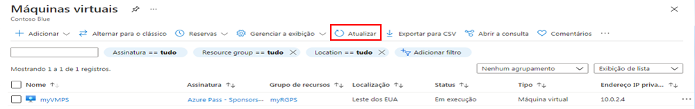
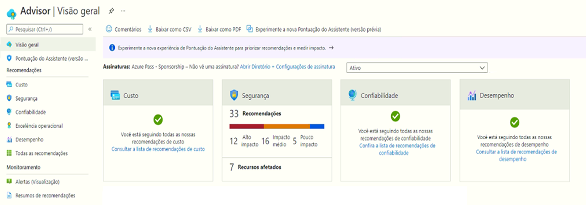

---
wts:
  title: 10 – Criar VM com o PowerShell (10 min)
  module: 'Module 03: Describe core solutions and management tools'
---
# <a name="10---create-a-vm-with-powershell-10-min"></a>10 – Criar VM com o PowerShell (10 min)

Neste passo a passo, vamos configurar o Cloud Shell, usar o módulo Azure PowerShell para criar um grupo de recursos e uma máquina virtual e analisar as recomendações do Assistente do Azure. 

# <a name="task-1-configure-the-cloud-shell"></a>Tarefa 1: Configurar o Cloud Shell 

Nesta tarefa, vamos configurar o Cloud Shell. 

1. Entre no [portal do Azure](https://portal.azure.com).** Você encontra as credenciais de logon na guia de recursos (bem ao lado desta guia de Instruções!) **
2. No portal do Azure, abra o **Azure Cloud Shell** clicando no ícone no canto superior direito do portal do Azure.

    

3. Quando solicitado a selecionar **Bash** ou **PowerShell**, selecione **PowerShell**.

4. Na tela **Não há armazenamentos montados**, selecione **Exibir configurações avançadas** e preencha as informações abaixo

    | Configurações | Valores |
    |  -- | -- |
    | Grupo de recursos | **Criar grupo de recursos** |
    | Conta de armazenamento (Criar nova conta e usar um nome globalmente exclusivo (ex.: cloudshellstoragemystorage)) | **cloudshellxxxxxxx** |
    | Compartilhamento de arquivo (criar novo) | **shellstorage** |

5. Selecione **Criar Armazenamento**

# <a name="task-2-create-a-resource-group-and-virtual-machine"></a>Tarefa 2: Criar um grupo de recursos e uma máquina virtual

Nesta tarefa, usaremos o PowerShell para criar um grupo de recursos e uma máquina virtual.  

1. Certifique-se de que o **PowerShell** esteja selecionado no menu suspenso superior esquerdo do painel do Cloud Shell.

2. Verifique o novo grupo de recursos executando os comandos a seguir na janela do PowerShell. Pressione **Enter** para executar o comando.

    ```PowerShell
    Get-AzResourceGroup | Format-Table
    ```

3. Crie uma máquina virtual colando o comando a seguir na janela do terminal. 

    ```PowerShell
    New-AzVm `
    -ResourceGroupName "myRGPS" `
    -Name "myVMPS" `
    -Location "East US" `
    -VirtualNetworkName "myVnetPS" `
    -SubnetName "mySubnetPS" `
    -SecurityGroupName "myNSGPS" `
    -PublicIpAddressName "myPublicIpPS"
    ```
    
4. Quando solicitado, insira o nome de usuário (**azureuser**) e a senha (**Pa$$w0rd1234**), que serão configurados como a conta de Administrador local nessas máquinas virtuais

5. Quando a VM for criada, feche o painel Cloud Shell da sessão do PowerShell.

6. No portal do Azure, procure **Máquinas virtuais** e verifique se o **myVMPS** está em execução. Isso pode levar alguns minutos.

    

7. Acesse a nova máquina virtual e analise a Visão geral e as configurações de rede para verificar se suas informações foram implantadas corretamente. 

# <a name="task-3-execute-commands-in-the-cloud-shell"></a>Tarefa 3: Executar comandos no Cloud Shell

Nesta tarefa, praticaremos a execução de comandos do PowerShell no Cloud Shell. 

1. No portal do Azure, abra o **Azure Cloud Shell** clicando no ícone no canto superior direito do portal do Azure.

2. Certifique-se de que o **PowerShell** esteja selecionado no menu suspenso superior esquerdo do painel do Cloud Shell.

3. Recupere informações sobre sua máquina virtual, incluindo nome, grupo de recursos, localização e status. Observe que o PowerState está **em execução**.

    ```PowerShell
    Get-AzVM -name myVMPS -status | Format-Table -autosize
    ```

4. Interrompa a máquina virtual usando o seguinte comando: 

    ```PowerShell
    Stop-AzVM -ResourceGroupName myRGPS -Name myVMPS
    ```
5. Quando solicitado, confirme (Sim) para a ação. Aguarde o status de **Êxito**.

6. Verifique o estado da sua máquina virtual. O PowerState agora deve ser **desalocado**. Você também pode verificar o status da máquina virtual no portal. Feche o Cloud Shell.

    ```PowerShell
    Get-AzVM -name myVMPS -status | Format-Table -autosize
    ```

# <a name="task-4-review-azure-advisor-recommendations"></a>Tarefa 4: Analisar recomendações do Assistente do Azure

**Observação:** Esta mesma tarefa está no laboratório Criar uma VM com a CLI do Azure. 

Nesta tarefa, revisaremos as recomendações do Assistente do Azure para nossa máquina virtual. 

1. Na folha **Todos os serviços**, procure e selecione **Assistente**. 

2. Na folha **Assistente**, selecione **Visão geral**. As recomendações de aviso são agrupadas por Confiabilidade, Segurança, Desempenho e Custo. 

    

3. Selecione **Todas as recomendações** e reserve um tempo para ver cada recomendação e as ações sugeridas. 

    **Observação:** Dependendo de seus recursos, suas recomendações serão diferentes. 

    

4. Observe que você pode baixar as recomendações como um arquivo CSV ou PDF. 

5. E também pode criar alertas. 

6. Se você tiver tempo, continue experimentando o Azure PowerShell. 

Parabéns! Você configurou o Cloud Shell, criou uma máquina virtual usando o PowerShell, praticou com comandos do PowerShell e viu as recomendações do Advisor.

**Observação**: Para evitar custos adicionais, você tem a opção de remover este grupo de recursos. Procure grupos de recursos, clique em seu grupo de recursos e, em seguida, clique em **Excluir grupo de recursos**. Verifique o nome do grupo de recursos e clique em **Excluir**. Monitore as **Notificações** para ver como a exclusão está ocorrendo.
