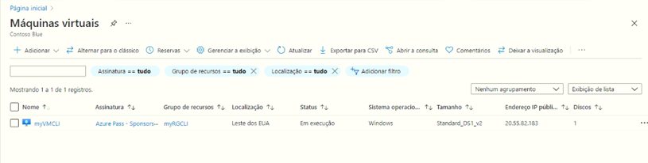
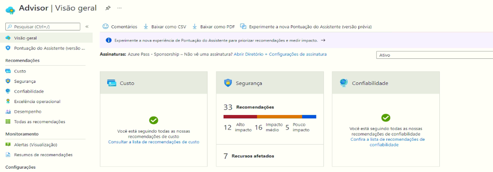
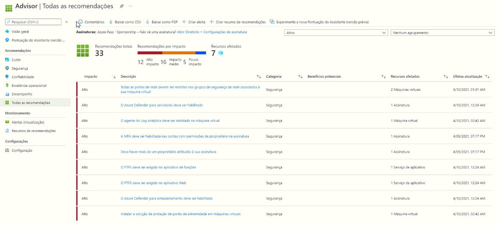

---
wts:
  title: 11 – Criar VM com a CLI (10 min)
  module: 'Module 03: Describe core solutions and management tools'
---
# <a name="11---create-a-vm-with-the-cli-10-min"></a>11 – Criar VM com a CLI (10 min)

Neste passo a passo, vamos configurar o Cloud Shell, usar a CLI do Azure para criar um grupo de recursos e máquina virtual e revisar as recomendações do Assistente do Azure. 

# <a name="task-1-configure-the-cloud-shell"></a>Tarefa 1: Configurar o Cloud Shell 

Nesta tarefa, vamos configurar o Cloud Shell e usar a CLI do Azure para criar um grupo de recursos e uma máquina virtual.  

1. Entre no [portal do Azure](https://portal.azure.com).

2. No portal do Azure, abra o **Azure Cloud Shell** clicando no ícone no canto superior direito do portal do Azure.

    
   
3. Na caixa de diálogo Bem-vindo ao Azure Cloud Shell, quando for solicitado para selecionar **Bash** ou **PowerShell**, selecione **Bash**. 

4. Uma nova janela será aberta dizendo **Não há armazenamentos montados**. Selecione **configurações avançadas**.

5. Na tela de configurações avançadas, preencha os campos a seguir e depois selecione Criar Armazenamento:
    - Grupo de Recursos: **Criar grupo de recursos**
    - Conta de Armazenamento: crie uma conta nova e use um nome globalmente exclusivo (ex.: cloudshellxyzstorage)
    - Compartilhamento de Arquivos: Crie um novo e dê a ele o nome cloudshellfileshare


# <a name="task-2-use-cli-to-create-a-virtual-machine"></a>Tarefa 2: Usar a CLI para criar uma máquina virtual

Nesta tarefa, usaremos a CLI do Azure para criar um grupo de recursos e uma máquina virtual.

1. Certifique-se de que o **Bash** esteja selecionado no menu suspenso superior esquerdo do painel do Cloud Shell (se não estiver selecionado, selecione-o).

    


2. Verifique o grupo de recursos sendo usado digitando o seguinte comando.

    ```cli
    az group list --output table
    ```

4. No Cloud Shell, insira o comando abaixo e verifique se cada linha, exceto a última, termina com o caractere de barra invertida (`\`). Se você digitar todo o comando na mesma linha, não use nenhum caractere de barra invertida. 

    ```cli
    az vm create \
    --name myVMCLI \
    --resource-group myRGCLI \
    --image UbuntuLTS \
    --location EastUS2 \
    --admin-username azureuser \
    --admin-password Pa$$w0rd1234
    ```

    >**Observação**: Se você estiver usando a linha de comando em um computador Windows, substitua o caractere de barra invertida (`\`) pelo acento circunflexo (`^`).

    **Observação**: O comando levará de 2 a 3 minutos para ser concluído. O comando criará uma máquina virtual e vários recursos associados a ela, como armazenamento, rede e recursos de segurança. Não passe para a próxima etapa até que a implantação da máquina virtual seja concluída. 

5. Quando o comando terminar de ser executado, na janela do navegador, feche o painel do Cloud Shell.

6. No portal do Azure, procure **Máquinas virtuais** e verifique se **myVMCLI** está em execução.

    


# <a name="task-3-execute-commands-in-the-cloud-shell"></a>Tarefa 3: Executar comandos no Cloud Shell

Nesta tarefa, praticaremos a execução de comandos CLI do Cloud Shell. 

1. No portal do Azure, abra o **Azure Cloud Shell** clicando no ícone no canto superior direito do portal do Azure.

2. Certifique-se de que **Bash** esteja selecionado no menu suspenso superior esquerdo do painel do Cloud Shell.

3. Recupere informações sobre a máquina virtual que você provisionou, incluindo nome, grupo de recursos, local e status. Observe que o PowerState está **em execução**.

    ```cli
    az vm show --resource-group myRGCLI --name myVMCLI --show-details --output table 
    ```

4. Parar a máquina virtual. Observe a mensagem de que a cobrança continua até que a máquina virtual seja desalocada. 

    ```cli
    az vm stop --resource-group myRGCLI --name myVMCLI
    ```

5. Verifique o status da sua máquina virtual. O PowerState agora deve ser **interrompido**.

    ```cli
    az vm show --resource-group myRGCLI --name myVMCLI --show-details --output table 
    ```

# <a name="task-4-review-azure-advisor-recommendations"></a>Tarefa 4: Analisar recomendações do Assistente do Azure

Nesta tarefa, revisaremos as recomendações do Assistente do Azure.

   **Observação:** Se você concluiu o laboratório anterior (Criar uma VM com o PowerShell), você já executou esta tarefa. 

1. Na folha **Todos os serviços**, procure e selecione **Assistente**. 

2. Na folha **Assistente**, selecione **Visão geral**. As recomendações de aviso são agrupadas por Confiabilidade, Segurança, Desempenho e Custo. 

    

3. Selecione **Todas as recomendações** e reserve um tempo para ver cada recomendação e as ações sugeridas. 

    **Observação:** Dependendo de seus recursos, suas recomendações serão diferentes. 

    

4. Observe que você pode baixar as recomendações como um arquivo CSV ou PDF. 

5. E também pode criar alertas. 

6. Se você tiver tempo, continue experimentando a CLI do Azure. 

Parabéns! Você configurou o Cloud Shell, criou uma máquina virtual usando a CLI do Azure, praticou com os comandos da CLI do Azure e viu as recomendações do Assistente.

**Observação**: Para evitar custos adicionais, você tem a opção de remover este grupo de recursos. Procure grupos de recursos, clique em seu grupo de recursos e, em seguida, clique em **Excluir grupo de recursos**. Verifique o nome do grupo de recursos e clique em **Excluir**. Monitore as **Notificações** para ver como a exclusão está ocorrendo.
