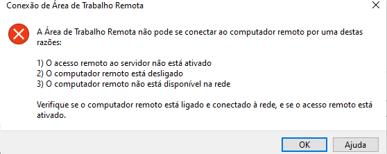

---
wts:
  title: 13 – Tráfego de rede seguro (10 min)
  module: 'Module 04: Describe general security and network security features'
---
# 13 – Tráfego de rede seguro (10 min)

Neste passo a passo, configuraremos um grupo de segurança de rede.

# Tarefa 1: Criar uma máquina virtual

Nesta tarefa, criaremos uma máquina virtual Windows Server 2019 Datacenter. 

1. Entre no [portal do Azure](https://portal.azure.com).

2. Na folha **Todos os serviços**, procure e selecione **Máquinas virtuais** e, em seguida, selecione **+ Adicionar, + Criar, + Nova** Máquina Virtual.

3. Na guia **Básico**, preencha as seguintes informações (mantenha os padrões para todo o resto):

    | Configurações | Valores |
    |  -- | -- |
    | Subscription | **Use o padrão fornecido** |
    | Resource group | **Criar grupo de recursos** |
    | Nome da máquina virtual | **SimpleWinVM** |
    | Região | **(EUA) Leste dos EUA**|
    | Image | **Windows Server 2019 Datacenter Gen 2**|
    | Tamanho | **Standard D2s v3**|
    | Nome de usuário da conta de administrador | **azureuser** |
    | Senha da conta de administrador | **Pa$$w0rd1234**|
    | Regras de porta de entrada | **Nenhuma**|

4. Alterne para a guia **Rede** e defina as seguintes configurações:

    | Configurações | Valores |
    | -- | -- |
    | Grupo de segurança de rede da NIC | **Nenhuma**|

5. Passe para a guia **Gerenciamento** e, na seção **Monitoramento**, selecione a seguinte configuração:

    | Configurações | Valores |
    | -- | -- |
    | Diagnóstico de inicialização | **Desabilitar**|

6. Mantenha os padrões restantes e clique no botão **Revisar + criar** na parte inferior da página.

7. Assim que a validação for aprovada, clique no botão **Criar**. Pode levar cerca de cinco minutos para implantar a máquina virtual.

8. Monitore a implantação. Pode levar alguns minutos para que o grupo de recursos e a máquina virtual sejam criados. 

9. Na folha de implantação ou na área de Notificação, clique em **Ir para o recurso**. 

10. Na folha da máquina virtual **SimpleWinVM**, clique em **Rede**, revise a guia **Regras de porta de entrada+** e observe que não há grupo de segurança de rede associado ao adaptador de rede da máquina virtual ou sub-rede à qual o adaptador de rede está conectado.

    **Observação**: Identifique o nome do adaptador de rede. Você precisará disso na próxima tarefa.

# Tarefa 2: Criar um 	Grupo de Segurança de Rede

Nesta tarefa, criaremos um grupo de segurança de rede e o associaremos ao adaptador de rede. 

1. Na folha **Todos os serviços**, procure e selecione **Grupos de segurança de rede** e, em seguida, selecione **+ Adicionar, + Criar, + Novo**

2. Na guia **Básico** da folha **Criar grupo de segurança de rede**, especifique as seguintes configurações.

    | Configuração | Valor |
    | -- | -- |
    | Subscription | **Use a assinatura padrão** |
    | Resource group | **Selecionar o padrão na lista suspensa** |
    | Nome | **myNSGSecure** |
    | Região | **(EUA) Leste dos EUA**  |

3. Clique em **Revisar + criar** e, em seguida, clique em **Criar** após a validação.

4. Depois que o NSG for criado, clique em **Ir para o recurso**.

5. Em **Configurações**, clique em **Adaptadores de rede** e em ** Associar**.

6. Selecione o adaptador de rede que você identificou na tarefa anterior. 

# Tarefa 3: Configurar uma regra de porta de segurança de entrada para permitir o RDP

Nesta tarefa, vamos permitir o tráfego do RDP para a máquina virtual configurando uma regra de porta de segurança de entrada. 

1. No portal do Azure, navegue até a folha da máquina virtual **SimpleWinVM**. 

2. No painel **Visão geral**, clique em **Conectar**.

3. Tente se conectar à máquina virtual: selecione o RDP, baixe e execute o arquivo RDP. Por padrão, o grupo de segurança de rede não permite RDP. Feche a janela de erro. 

    

4. Na folha da máquina virtual, role para baixo até a seção **Configurações**. Selecione **Rede** e observe as regras de entrada para o grupo de segurança de rede **myNSGSecure (conectado ao adaptador de rede: myVMNic)** . Ele nega todo tráfego de entrada, exceto o tráfego dentro da rede virtual e as investigações do balanceador de carga.

5. Na guia **Regras de porta de entrada**, clique em **Adicionar regra de porta de entrada**. Clique em **Adicionar** depois de concluir. 

    | Configuração | Valor |
    | -- | -- |
    | Fonte | **Qualquer**|
    | Intervalos de portas de origem | **\*** |
    | Destino | **Qualquer** |
    | Intervalos de portas de destino | **3389** |
    | Protocolo | **TCP** |
    | Ação | **Permitir** |
    | Prioridade | **300** |
    | Nome | **AllowRDP** |

6. Selecione **Adicionar** e espere a regra ser provisionada. Tente conectar de novo o RDP à máquina virtual voltando a **Conectar**. Desta vez, você deve ter êxito. Lembre-se de que o usuário é **azureuser** e a senha é **Pa$$w0rd1234**.

# Tarefa 4: Configurar uma regra de porta de segurança de saída para negar o acesso à Internet

Nesta tarefa, criaremos uma regra de porta de saída do NSG que negará o acesso à Internet e, em seguida, testaremos para garantir que a regra está funcionando.

1. Continue na sua sessão do RDP da máquina virtual. 

2. Depois que a máquina iniciar, abra um navegador **Internet Explorer**. 

3. Verifique se você pode acessar **https://www.bing.com** e, em seguida, feche o Internet Explorer. Você precisará trabalhar com os pop-ups de segurança aprimorada do IE. 

    **Observação**: Agora vamos configurar uma regra para negar o acesso de saída à Internet. 

4. De volta ao portal do Azure, retorne à folha da máquina virtual **SimpleWinVM**. 

5. Em **Configurações**, clique em **Rede** e em **Regras de porta de saída**.

6. Observe que há uma regra, **AllowInternetOutbound**. Esta é uma regra padrão e não pode ser removida. 

7. Clique em **Adicionar regra de porta de saída** à direita do grupo de segurança de rede **myNSGSecure (conectado à interface de rede: myVMNic)** e configure uma nova rega de segurança de saída com uma prioridade mais alta que negará o tráfego da Internet. Clique em **Adicionar** quando terminar. 

    | Configuração | Valor |
    | -- | -- |
    | Fonte | **Qualquer**|
    | Intervalos de portas de origem | **\*** |
    | Destino | **Marca de serviço** |
    | Marca de serviço de destino | **Internet** |
    | Intervalos de portas de destino | **\*** |
    | Protocolo | **TCP** |
    | Ação | **Deny** |
    | Prioridade | **4000** |
    | Nome | **DenyInternet** |

8. Selecione **Adicionar** Devolva os RDPs à VM. 

9. Navegue até **https://www.microsoft.com** . A página não deve ser exibida. Pode ser necessário trabalhar com pop-ups adicionais de segurança aprimorada do Internet Explorer.  

**Observação**: Para evitar custos adicionais, você tem a opção de remover este grupo de recursos. Procure grupos de recursos, clique em seu grupo de recursos e, em seguida, clique em **Excluir grupo de recursos**. Verifique o nome do grupo de recursos e clique em **Excluir**. Monitore as **Notificações** para ver como a exclusão está ocorrendo.
