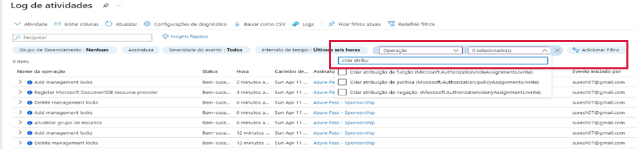

---
wts:
  title: 14 – Gerenciar acesso com o RBAC (5 min)
  module: 'Module 05: Describe identity, governance, privacy, and compliance features'
---
# 14 – Gerenciar acesso com o RBAC (5 min)

Neste passo a passo, vamos atribuir funções de permissão e visualizar recursos e logs.

# Tarefa 1: Visualizar e atribuir funções

Nesta tarefa, atribuiremos a função de colaborador da máquina virtual. 

1. Entre no [portal do Azure](https://portal.azure.com).

2. Na folha **Todos os serviços**, procure e selecione **Grupos de recursos** e, em seguida, selecione **+ Adicionar + Novo + Criar**.

3. Criar um grupo de recursos. Clique em **Criar** quando terminar. 

    | Configuração | Valor |
    | -- | -- |
    | Subscription | **Use o padrão fornecido** |
    | Resource group | **myRGRBAC** |
    | Região | **(EUA) Leste dos EUA** |
   

4. Clique em **Revisar + criar** e, em seguida, clique em **Criar**.

5. **Atualize** a página do grupo de recursos e clique na entrada que representa o grupo de recursos recém-criado.

6. Clique na folha **Controle de acesso (IAM)** e alterne para a guia **Funções**. Percorra o grande número de definições de funções disponíveis. Use os ícones informativos para ter uma ideia das permissões de cada função. Observe que também há informações sobre o número de usuários e grupos atribuídos a cada função.
7. 

7. Alterne para a guia **Atribuições de função** da folha **myRGRBAC – Controle de acesso (IAM)** , clique em **+ Adicionar** e, em seguida, clique em **Adicionar atribuição de função**. Procure a função Colaborador da Máquina Virtual e selecione. Alterne para a guia "Membros" e Atribua acesso a: usuário, grupo ou entidade de serviço. Em seguida, clique em + Selecionar membros e digite seu nome para a função de pesquisa pop-up e clique em 'selecionar'. Depois, clique em 'Revisar e atribuir'

    
    

 

    **Observação:** A função de colaborador da máquina virtual permite que você gerencie máquinas virtuais, mas não acesse seu sistema operacional ou gerencie a rede virtual e a conta de armazenamento às quais estão conectadas.

  

8. **Atualize** a página de atribuições de função e certifique-se de que agora você esteja listado como um colaborador da máquina virtual. 

    **Observação**: Na verdade, essa atribuição não concede a você nenhum privilégio adicional, pois sua conta já tem a função de Proprietário, que inclui todos os privilégios associados à função de Colaborador.

# Tarefa 2: Monitorar atribuições de funções e remover uma função

Nesta tarefa, veremos o log de atividades para verificar a atribuição de função e, em seguida, removeremos a função. 

1. Na folha do grupo de recursos myRGRBAC, clique em **Log de atividades**.

2. Clique em **Adicionar filtro**, selecione **Operação** e, em seguida, **Criar atribuição de função**.

    

3. Verifique se o log de atividades mostra sua atribuição de função. 

    **Observação**: Você consegue descobrir como remover sua atribuição de função?

Parabéns! Você criou um grupo de recursos, atribuiu uma função de acesso a ele e visualizou logs de atividades. 

**Observação**: Para evitar custos adicionais, você tem a opção de remover este grupo de recursos. Procure grupos de recursos, clique em seu grupo de recursos e, em seguida, clique em **Excluir grupo de recursos**. Verifique o nome do grupo de recursos e clique em **Excluir**. Monitore as **Notificações** para ver como a exclusão está ocorrendo.

