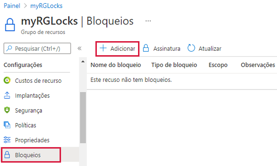
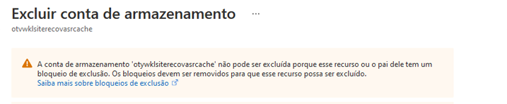
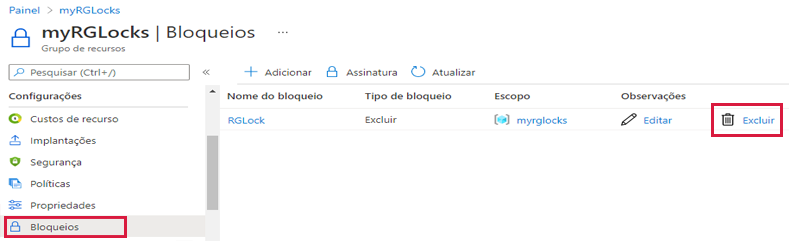

---
wts:
  title: 15 – Gerenciar bloqueios de recursos (5 min)
  module: 'Module 05: Describe identity, governance, privacy, and compliance features'
---
# 15 – Gerenciar bloqueios de recursos (5 min)

Neste passo a passo, vamos adicionar um bloqueio ao grupo de recursos e testar a exclusão do grupo de recursos. Os bloqueios podem ser aplicados em uma assinatura de grupos de recursos ou recursos individuais para evitar exclusão acidental ou modificação de recursos críticos.  

# Tarefa 1:  Adicionar um bloqueio ao grupo de recursos e testar a exclusão

Nesta tarefa, adicionaremos um bloqueio de recurso ao grupo de recursos e testaremos a exclusão do grupo. 

1. Entre no [portal do Azure](https://portal.azure.com).

2. No portal do Azure, navegue até o grupo de recursos **myRGLocks**.

3. Você pode aplicar um bloqueio a uma assinatura, grupo de recursos ou recurso individual para evitar exclusão acidental ou modificação de recursos críticos. 

4. Na seção **Configurações**, clique em **Bloqueios** e em **+Adicionar**. 

    

5. Configure o novo bloqueio. Quando terminar, clique em **OK**. 

    | Configuração | Valor |
    | -- | -- |
    | Nome do bloqueio | '''RGLock''’ |
    | Tipo de bloqueio | **Excluir** |
    | | |

6. Clique em **Visão geral** e, em seguida, em **Excluir grupo de recursos**. Digite o nome do grupo de recursos e clique em **OK**. Você recebe uma mensagem de erro informando que o grupo de recursos está bloqueado e não pode ser excluído.

    

# Tarefa 2: Testar a exclusão de um membro do grupo de recursos

Nesta tarefa, testaremos se o bloqueio de recursos protege uma conta de armazenamento no grupo de recursos. 

1. Na folha **Todos os serviços**, procure e selecione **Contas de armazenamento** e, em seguida, clique em **+ Adicionar, + Criar ou + Novo**. 

2. Na página **Contas de armazenamento**, folha **+Adicionar +Novo +Criar **, preencha as seguintes informações (substitua **xxxx** no nome da conta de armazenamento por letras e dígitos de forma que o nome seja globalmente exclusivo). Mantenha os padrões para todo o resto.

    | Configuração | Valor | 
    | --- | --- |
    | Assinatura | **Selecione sua assinatura** |
    | Resource group | **myRGLocks** |
    | Nome da conta de armazenamento | **storageaccountxxxx** |
    | Location | **(EUA) Leste dos EUA**  |
    | Desempenho | **Standard** |
    | Tipo de conta | **StorageV2 (v2 de uso geral)** |
    | Replicação | **LRS (armazenamento com redundância local)** |
    | Camada de acesso (padrão) | **Frequente** |
   

3. Clique em **Revisar + Criar** para revisar as configurações da sua conta de armazenamento e permitir que o Azure valide a configuração. 

4. Depois de validado, clique em **Criar**. Aguarde a notificação de que a conta foi criada com sucesso. 

5.  Aguarde a notificação de que a conta de armazenamento foi criada com sucesso. 

6. Acesse sua nova conta de armazenamento e, no painel **Visão geral**, clique em **Excluir**. Você receberá uma mensagem de erro informando que o recurso ou o pai dele tem um bloqueio de exclusão. 

    

    **Observação**: Embora não tenhamos criado um bloqueio especificamente para a conta de armazenamento, criamos um bloqueio no nível do grupo de recursos, que contém a conta de armazenamento. Como tal, este bloqueio de nível *pai* nos impede de excluir o recurso e a conta de armazenamento herda o bloqueio do pai.

# Tarefa 3: Remover o bloqueio de recursos

Nesta tarefa, vamos remover o bloqueio de recursos e testar. 

1. Retorne à folha do grupo de recursos **myRGLocks-XXXXXXXX** e, na seção **Configurações**, clique em **Bloqueios**.
    
2. Clique no link **Excluir** à direita da entrada **myRGLocks-XXXXXXXX**, à direita de **Editar**.

    

3. Volte para a folha da conta de armazenamento e confirme que agora você pode excluir o recurso.

Parabéns! Você criou um grupo de recursos, adicionou um bloqueio ao grupo de recursos e testou a exclusão, testou a exclusão de um recurso no grupo de recursos e removeu o bloqueio de recursos. 

**Observação**: Para evitar custos adicionais, você tem a opção de remover este grupo de recursos. Procure grupos de recursos, clique em seu grupo de recursos e, em seguida, clique em **Excluir grupo de recursos**. Verifique o nome do grupo de recursos e clique em **Excluir**. Monitore as **Notificações** para ver como a exclusão está ocorrendo.
