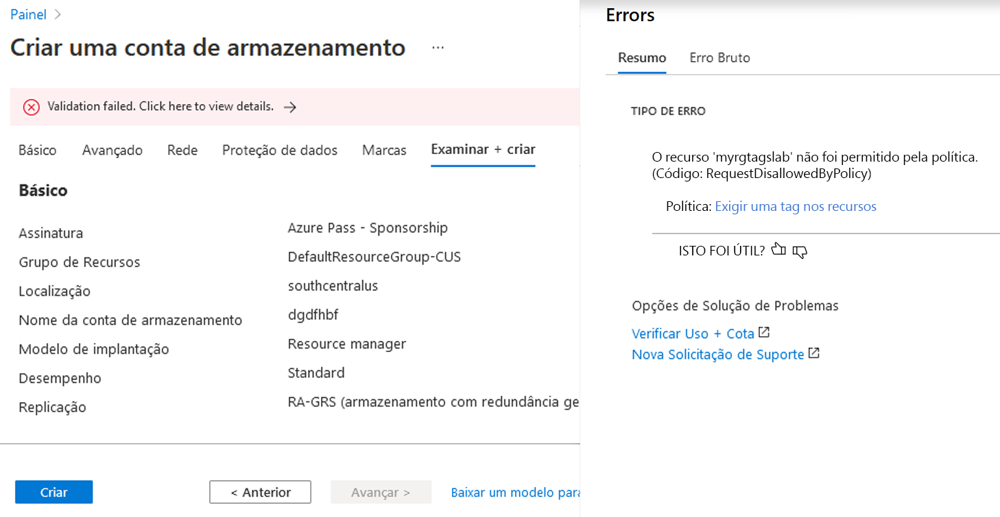
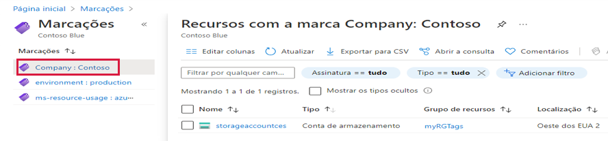
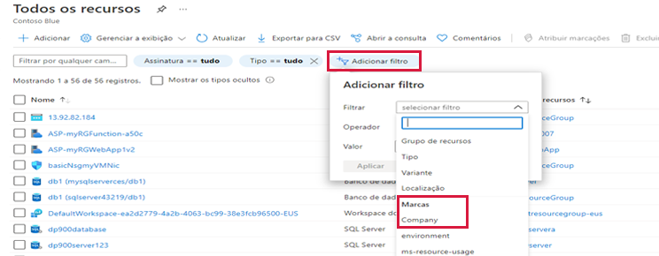

---
wts:
  title: 16 – Implantar marcação de recursos (5 min)
  module: 'Module 05: Describe identity, governance, privacy, and compliance features'
---
# 16 – Implantar marcação de recursos (5 min)

Neste passo a passo, vamos criar uma atribuição de política que requer marcação, criar uma conta de armazenamento e testar a marcação, visualizar recursos com uma marcação especificada e remover a política de marcação.

# Tarefa 1: Criar atribuição de Política 

Nesta tarefa, vamos configurar a política **Exigir uma marca nos recursos** e atribuí-la à nossa assinatura. 

1. Entre no [portal do Azure](https://portal.azure.com).

2. Na folha **Todos os serviços**, procure e selecione **Política**.

3. Role para baixo até a seção **Criação**, clique em **Atribuições** e, em seguida, clique em **Atribuir política** na parte superior da página.

4. Observe que o **Escopo** de nossa política abrange toda a assinatura. 

5. Em **Básico**, selecione o botão de reticências **Definição de política** (lado direito da caixa de texto). Na caixa **Pesquisar**, insira a **marca** de valor. Uma lista de políticas relacionadas com a palavra **marca** aparecerá. Role para baixo até encontrar a definição **Exigir uma marca e seu valor nos recursos**, clique nela e clique em **Selecionar**.

   
   
6.  Na guia **Parâmetros**, digite **Empresa: Contoso ** para o nome do par de chave/valor. Clique em **Revisar + criar** e, em seguida, em **Criar**.

  

7. A atribuição de política **Exigir uma marca e seu valor nos recursos** está em vigor. Quando um recurso é criado, ele deve incluir uma marca com a chave de Empresa: Contoso.
   **Observação – você precisa esperar até 30 minutos para que a Política seja aplicada.** 

  

# Tarefa 2: Criar uma conta de armazenamento para testar a marcação necessária

Nesta tarefa, criaremos contas de armazenamento para testar a marcação necessária. 

1. No portal do Azure, na folha **Todos os serviços**, procure e selecione **Contas de armazenamento** e, em seguida, selecione **+Adicionar +Nova +Criar**.

2. Na guia **Básico** da folha **Criar conta de armazenamento**, preencha as seguintes informações (substitua **xxxx** no nome da conta de armazenamento por letras e dígitos de forma que o nome seja globalmente exclusivo). Mantenha os padrões para todo o resto.

    | Configuração | Valor | 
    | --- | --- |
    | Subscription | **Use o padrão fornecido** |
    | Resource group | **Criar grupo de recursos** |
    | Nome da conta de armazenamento | **storageaccountxxxx** |
    | Location | **(EUA) Leste dos EUA** |

3. Clique em **Revisar + Criar**. 

    **Observação:** Estamos testando para ver o que acontece quando a marca não é fornecida. Pode levar até 30 minutos para as Políticas entrarem em vigor.

4. Você receberá uma mensagem de falha na validação. Clique na mensagem **Clique aqui para ver os detalhes**. Na folha **Erros**, na guia **Resumo**, observe a mensagem de erro informando que o recurso não foi permitido pela Política.

    **Observação:** Se você visualizar a guia Erro bruto, verá o nome da marca específico necessário. 

    

5. Feche o painel **Erro** e clique em **Anterior** (parte inferior da tela). Forneça as informações de marcação. 

    | Configuração | Valor | 
    | --- | --- |
    | Nome da marca | **Empresa:Contoso** (pode não estar na lista suspensa) |

6. Clique em **Revisar + criar** e verifique se a validação foi bem-sucedida. Clique em **Criar** para implantar a conta de armazenamento. 

# Tarefa 3: Veja todos os recursos com uma marca específica

1. No portal do Azure, na folha **Todos os serviços**, procure e selecione **Marcas**.

2. Observe todas as marcas e seus valores. Clique no par de chave/valor **Empresa: Contoso**. Isso exibirá uma folha mostrando a conta de armazenamento recém-criada, contanto que você tenha incluído a marca durante sua implantação. 

   

3. No Portal, exiba a folha **Todos os recursos**.

4. Clique em **Adicionar filtro** e adicione a chave de marca da **Empresa** como a categoria do filtro. Com o filtro aplicado, apenas sua conta de armazenamento será listada.

    

# Tarefa 4: Excluir a atribuição de política

Nesta tarefa, removeremos a política **Exigir uma marca nos recursos** para que ela não afete nosso trabalho futuro. 

1. No portal, na folha **Todos os serviços**, procure e selecione **Política**.

2. Clique na entrada de política **Exigir uma marca nos recursos**.

3. Clique em **Excluir atribuição** no menu superior.

4. Confirme que deseja excluir a atribuição de política na caixa de diálogo **Excluir atribuição** clicando em **Sim**

5. Se você tiver tempo, crie outro recurso sem uma marca para garantir que a política não esteja mais em vigor.

Parabéns! Neste passo a passo, criamos uma atribuição de política que exigiu marcação, criamos um recurso (conta de armazenamento) e testamos a Política para marcação, visualizamos recursos com uma marcação especificada e removemos a política de marcação.

**Observação**: Para evitar custos adicionais, você tem a opção de remover este grupo de recursos. Procure grupos de recursos, clique em seu grupo de recursos e, em seguida, clique em **Excluir grupo de recursos**. Verifique o nome do grupo de recursos e clique em **Excluir**. Monitore as **Notificações** para ver como a exclusão está ocorrendo.
