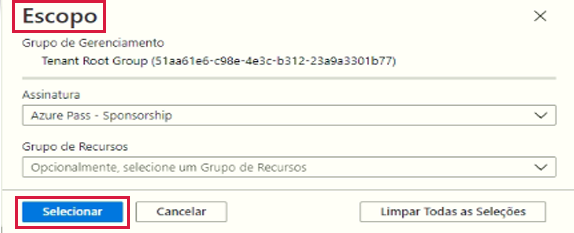
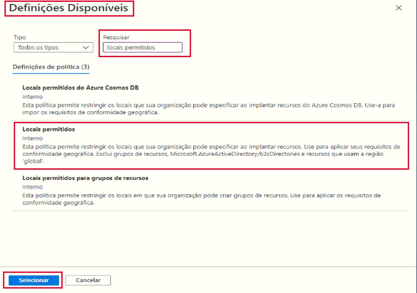
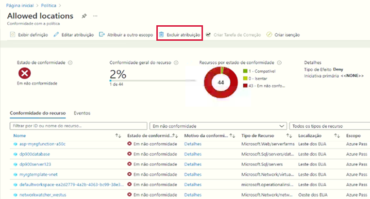

---
wts:
  title: 17 – Criar Azure Policy (10 min)
  module: 'Module 05: Describe identity, governance, privacy, and compliance features'
---
# 17 – Criar Azure Policy (10 min)

Neste passo a passo, criaremos uma Azure Policy para restringir a implantação dos recursos do Azure em um local específico.

# Tarefa 1: Criar atribuição de Política 

Nesta tarefa, vamos configurar a política de localização permitida e atribuí-la à nossa assinatura. 

1. Entre no [portal do Azure](https://portal.azure.com).

2. Na folha **Todos os serviços**, procure e selecione **Política**. Na seção **Criação**, clique em **Definições**.  Reserve um momento para revisar a lista de definições de política integradas. Por exemplo, na lista suspensa **Categoria**, selecione apenas **Calcular**. Observe que a definição **SKUs permitidos de máquina virtual** possibilita especificar um conjunto de SKUs de máquina virtual que pode ser implantado pela sua empresa.

3. Retorne à página **Política**, na seção **Criação**, clique em **Atribuições**. Uma atribuição é uma política que foi atribuída para entrar em vigor em um escopo específico. Por exemplo, uma definição pode ser atribuída ao escopo da assinatura. 

4. Clique em **Atribuir política** na parte superior da página **Política – Atribuições**.

5. Na página **Atribuir Política**, mantenha o Escopo padrão.

      | Configuração | Valor | 
    | --- | --- |
    | Escopo| **Use o padrão selecionado**|
    | Definição de política | selecione as reticências, pesquise **Locais Permitidos** e pressione **Selecionar** |
    | Nome da Atribuição | **Locais permitidos** |
    
    
6. Na guia **Parâmetros**, selecione **Oeste do Japão**. Clique em **Revisar + criar** e, em seguida, em **Criar**.

    **Observação**: Um escopo determina a quais recursos ou agrupamento de recursos a atribuição de política se aplica. Em nosso caso, poderíamos atribuir essa política a um grupo de recursos específico, no entanto, optamos por atribuir a política no nível de assinatura. Esteja ciente de que os recursos podem ser excluídos com base na configuração do escopo. As exclusões são opcionais.

    **Observação**: Esta definição de política de **Locais permitidos** especificará um local no qual todos os recursos devem ser implantados. Se um local diferente for escolhido, a implantação não será permitida. Para obter mais informações, consulte a página [Amostras de Azure Policy](https://docs.microsoft.com/en-us/azure/governance/policy/samples/index).

   

9. A atribuição de política de **Locais permitidos** agora está listada no painel **Política – Atribuições** e está em vigor, impondo a política no nível de escopo que especificamos (nível de assinatura).

# Tarefa 2: Testar política de localização permitida

Nesta tarefa, testaremos a política de localização permitida. 

1. No portal do Azure, na folha **Todos os serviços**, procure e selecione **Contas de armazenamento** e, em seguida, selecione **+ Criar**.

2. Configure a conta de armazenamento (substitua **xxxx** no nome da conta de armazenamento por letras e dígitos de forma que o nome seja globalmente exclusivo). Mantenha os padrões para todo o resto. 

    | Configuração | Valor | 
    | --- | --- |
    | Subscription | **Use o padrão fornecido** |
    | Resource group | **myRGPolicy** (criar novo) |
    | Nome da conta de armazenamento | **storageaccountxxxx** |
    | Location | **(EUA) Leste dos EUA** |

3. Clique em **Revisar + criar** e, em seguida, clique em **Criar**. 

4. Você encontrará o erro de **falha de implantação** informando que o recurso não foi permitido pela política, incluindo a política **Locais permitidos**.

# Tarefa 3: Excluir a atribuição de política

Nesta tarefa, removeremos a atribuição e o teste da política de localização permitida. 

Excluiremos a atribuição de política para garantir que não seremos bloqueados em nenhum trabalho futuro que desejamos fazer.

1. Na folha **Todos os serviços**, procure e selecione **Política** e clique em sua política de **Locais permitidos**.

    **Observação**: Na folha **Política**, você pode visualizar o estado de conformidade das várias políticas atribuídas.

    **Observação**: A política de localização permitida pode mostrar recursos não compatíveis. Nesse caso, esses são recursos criados antes da atribuição de política.
 
2. Selecione **Locais Permitidos**. Será aberta uma janela de Conformidade da Política de Locais Permitidos.

3. Clique em **Excluir atribuição** no menu superior. Confirme que deseja excluir a atribuição de política selecionando **Sim**

   

4. Tente criar outra conta de armazenamento para garantir que a política não esteja mais em vigor.

    **Observação**: Os cenários comuns em que a política de **Locais permitidos** pode ser útil incluem: 
    - *Rastreamento de custos*: Você pode ter assinaturas diferentes para locais regionais diferentes. A política vai garantir que todos os recursos sejam implantados na região pretendida para ajudar no rastreamento de custos. 
    - *Residência de dados e conformidade de segurança*: Você também pode ter requisitos de residência de dados e criar assinaturas por cliente ou cargas de trabalho específicas e definir que todos os recursos devem ser implantados em um datacenter específico para garantir os requisitos de conformidade de dados e segurança.

Parabéns! Você criou uma Azure Policy para restringir a implantação de recursos do Azure em um datacenter específico.

**Observação**: Para evitar custos adicionais, você tem a opção de remover este grupo de recursos. Procure grupos de recursos, clique em seu grupo de recursos e, em seguida, clique em **Excluir grupo de recursos**. Verifique o nome do grupo de recursos e clique em **Excluir**. Monitore as **Notificações** para ver como a exclusão está ocorrendo.
