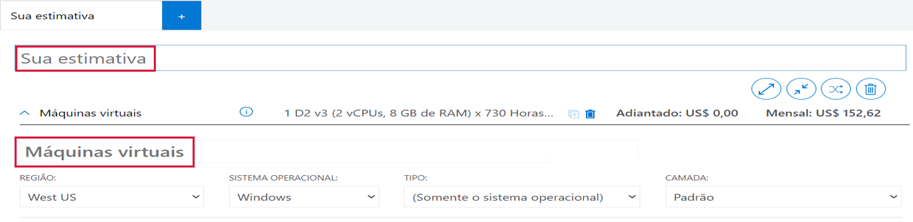
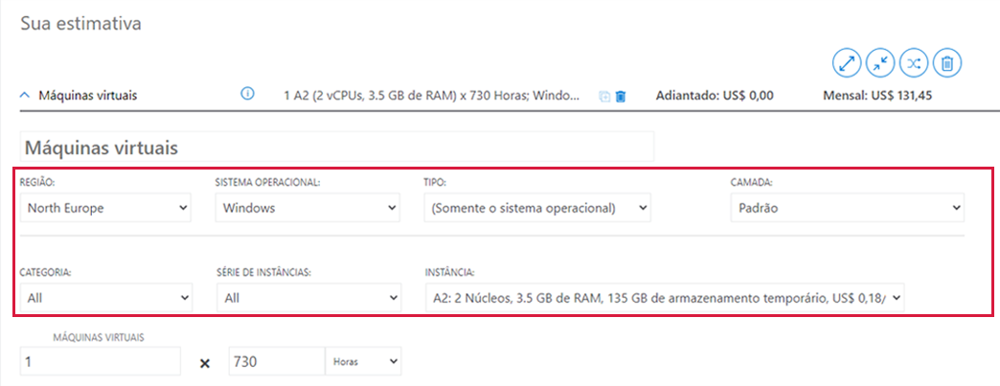
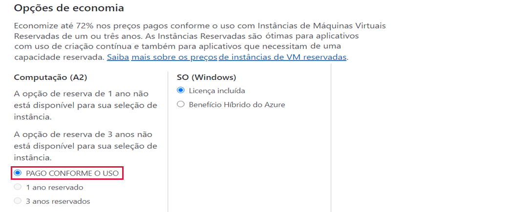
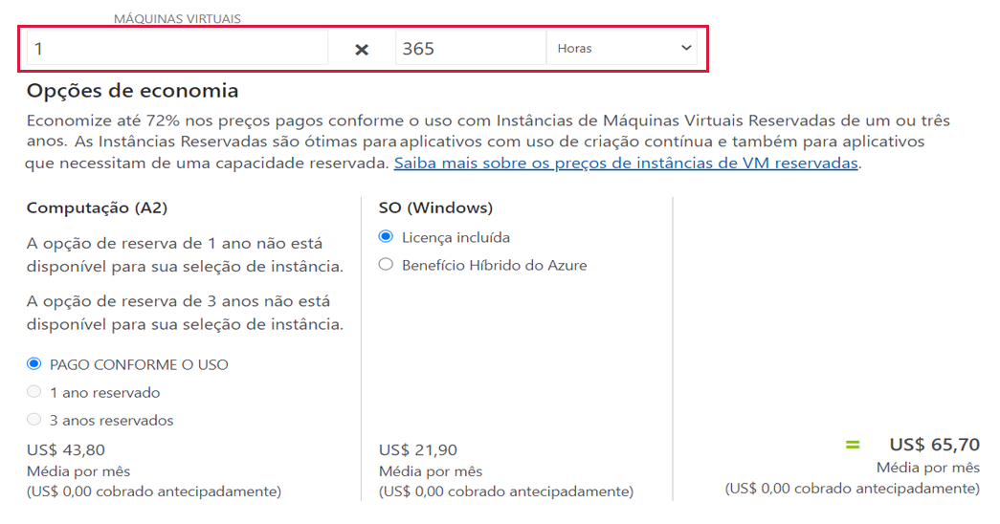
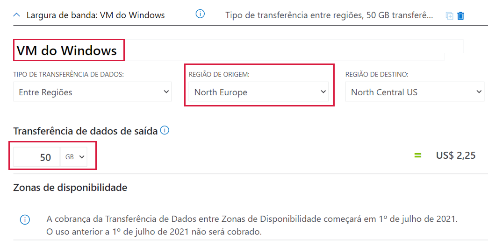
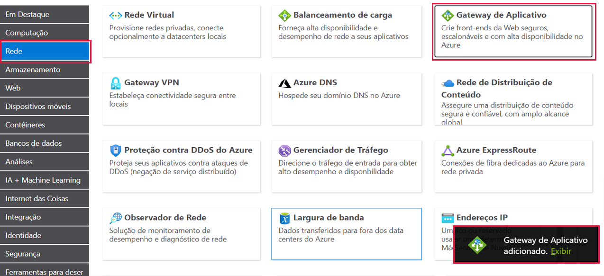

---
wts:
  title: 19 – Usar a Calculadora de Preços do Azure (10 min)
  module: 'Module 06: Describe Azure cost management and service level agreements'
---
# 19 – Usar a Calculadora de Preços do Azure (10 min)

Neste passo a passo, usaremos a Calculadora de Preços do Azure para gerar uma estimativa de custo para uma máquina virtual do Azure e recursos de rede relacionados.

# Tarefa 1: Configurar a calculadora de preços

Nesta tarefa, vamos estimar o custo de uma infraestrutura de amostra usando a Calculadora de Preços do Azure. 

<bpt id="p1">**</bpt>Note<ept id="p1">**</ept>: To create an Azure Pricing Calculator estimate, this walkthrough provides example configurations for the VM and related resources. Use this example configurations or provide the Azure Pricing Calculator with details of your <bpt id="p1">*</bpt>actual<ept id="p1">*</ept> resource requirements instead.

1. No navegador, navegue até a página da web da [Calculadora de Preços do Azure](https://azure.microsoft.com/en-us/pricing/calculator/).

2. Para adicionar detalhes de sua configuração de VM, clique em **Máquinas virtuais** na guia **Produtos**. Role para baixo para ver os detalhes da máquina virtual. 

3. Replace <bpt id="p1">**</bpt>Your Estimate<ept id="p1">**</ept> and <bpt id="p2">**</bpt>Virtual Machines<ept id="p2">**</ept> text with more descriptive names for your Azure Pricing Calculator estimate and your VM configuration. This walkthrough example uses <bpt id="p1">**</bpt>My Pricing Calculator Estimate<ept id="p1">**</ept> for the estimate, and <bpt id="p2">**</bpt>Windows VM<ept id="p2">**</ept> for the VM configuration.

   

4. Modifique a configuração padrão da VM.

    | Configurações | Valor |
    | -- | -- |
    | Região | **Norte da Europa** |
    | Sistema operacional | **Windows** |
    | Type | **(Somente SO)** |
    | Camada | **Standard** |  
    | Instância | **A2: 2 núcleos(s), 3,5 GB de RAM, 135 GB de armazenamento temporário** |

   

    <bpt id="p1">**</bpt>Note<ept id="p1">**</ept>: The VM instance specifications and pricing may differ from those in this example. Follow this walkthrough by choosing an instance that matches the example as closely as possible. To view details about the different VM product options, choose <bpt id="p1">**</bpt>Product details<ept id="p1">**</ept> from the <bpt id="p2">**</bpt>More info<ept id="p2">**</ept> menu on the right.

5. Defina a **Opção de cobrança** para **Pré-pago**.

   

6. **Observação**: Este passo a passo oferece configurações de exemplo para criar uma estimativa pela Calculadora de Preços do Azure para a VM e recursos relacionados.

    Deixe o número de VMs definido em `1` e altere o valor de horas por mês para `365`.

   

7. No painel **Discos gerenciados do SO**, modifique a configuração de armazenamento em VM padrão.

    | Camada | Tamanho do disco | Número de discos | Instantâneo | Transações de armazenamento |
    | ---- | --------- | --------------- | -------- | -------------------- |
    | HDD Standard | S30: 1024 GiB | 1 | Desativado | 10.000 |

   

8. To add networking bandwidth to your estimate, go to the top of the Azure Pricing Calculator webpage. Click <bpt id="p1">**</bpt>Networking<ept id="p1">**</ept> in the product menu on the left, then click the <bpt id="p2">**</bpt>Bandwidth<ept id="p2">**</ept> tile. In the <bpt id="p1">**</bpt>Bandwidth added<ept id="p1">**</ept> message dialog, click <bpt id="p2">**</bpt>View<ept id="p2">**</ept>.

   

9. Substitua o texto **Sua estimativa** e **Máquinas virtuais** por nomes mais descritivos para a sua estimativa da Calculadora de Preços do Azure e para a sua configuração de VM.

    | Região | Quantidade de transferência de dados de saída da zona 1 |
    | ------ | -------------------------------------- |
    | Norte da Europa | 50 GB |

   

10. To add an Application Gateway, return to the top of the Azure Pricing Calculator webpage. In the <bpt id="p1">**</bpt>Networking<ept id="p1">**</ept> product menu, click the <bpt id="p2">**</bpt>Application Gateway<ept id="p2">**</ept> tile. In the <bpt id="p1">**</bpt>Application Gateway<ept id="p1">**</ept> message dialog, click <bpt id="p2">**</bpt>View<ept id="p2">**</ept>.

    

11. O nome da estimativa e o nome da configuração de VM realçados indicam como adicionar um nome de estimativa e um nome de configuração de VM a uma estimativa da Calculadora de Preços do Azure.

    | Configurações | Valor |
    | -- | -- |
    | Região | **Norte da Europa** |
    | Camada | **Basic** |
    | Tamanho | **Pequeno** |
    | Instâncias | **1** |  
    | Horas | **365** |
    | Dados processados | **50 GB** |
    | Zona 1: América do Norte, Europa | **50 GB**|

    

# Tarefa 2: Revisar a estimativa de preços

Nesta tarefa, vamos revisar os resultados da Calculadora de Preços do Azure. 

1. Role até o final da página da web da Calculadora de Preços do Azure para ver o **Custo mensal estimado total**.

    <bpt id="p1">**</bpt>Note<ept id="p1">**</ept>: Explore the various options available within the Azure Pricing Calculator. For example, this walkthrough requires you to update the currency to Euro.

2. Altere a moeda para Euro e selecione **Exportar** para baixar uma cópia da estimativa para visualização off-line no formato Microsoft Excel (`.xlsx`).

    

    

Congratulations! You downloaded an estimate from the Azure Pricing Calculator.
