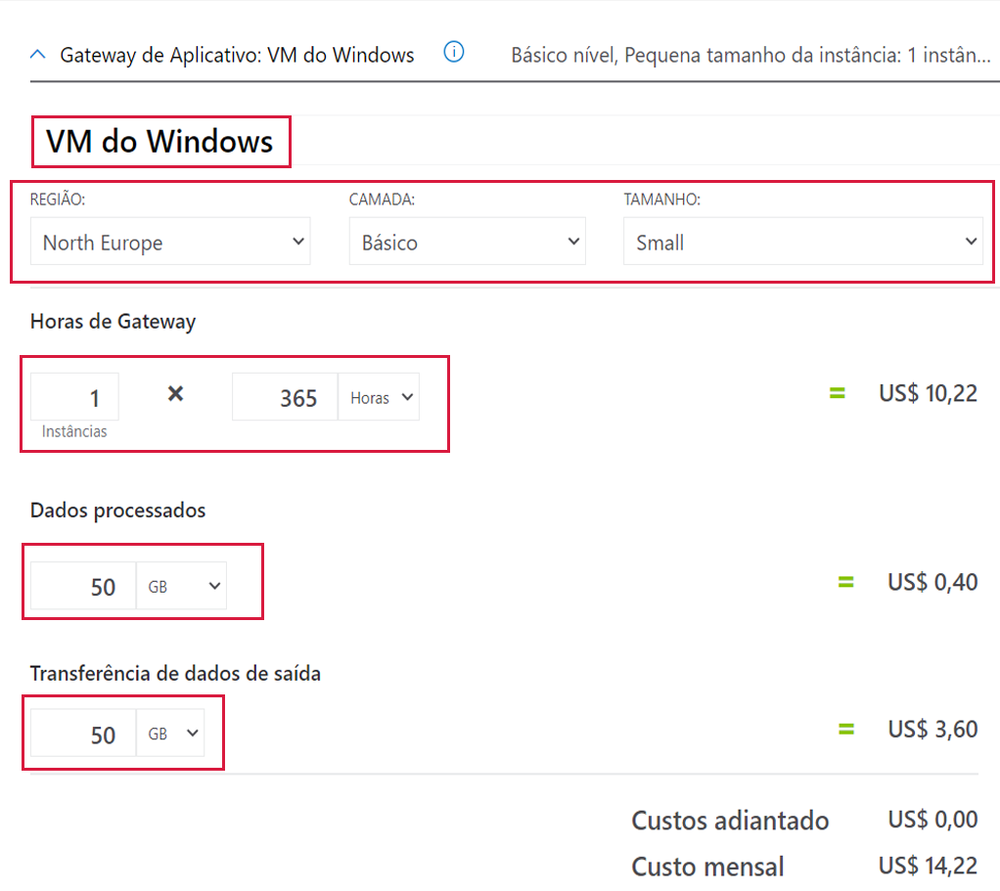
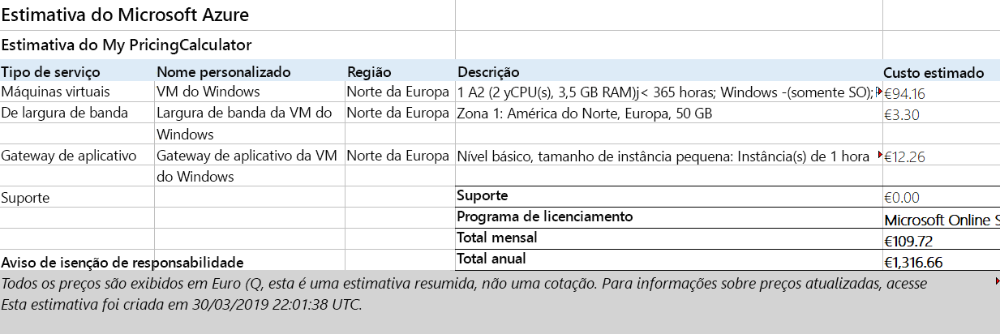

---
wts:
  title: 19 – Usar a Calculadora de Preços do Azure (10 min)
  module: 'Module 06: Describe Azure cost management and service level agreements'
---
# 19 – Usar a Calculadora de Preços do Azure (10 min)

Neste passo a passo, usaremos a Calculadora de Preços do Azure para gerar uma estimativa de custo para uma máquina virtual do Azure e recursos de rede relacionados.

# Tarefa 1: Configurar a calculadora de preços

Nesta tarefa, vamos estimar o custo de uma infraestrutura de amostra usando a Calculadora de Preços do Azure. 

**Observação**: Este passo a passo oferece configurações de exemplo para criar uma estimativa pela Calculadora de Preços do Azure para a VM e recursos relacionados. Use essas configurações de exemplo ou forneça detalhes dos seus requisitos *reais* de recursos à Calculadora de Preços do Azure.

1. No navegador, navegue até a página da web da [Calculadora de Preços do Azure](https://azure.microsoft.com/en-us/pricing/calculator/).

2. Para adicionar detalhes de sua configuração de VM, clique em **Máquinas virtuais** na guia **Produtos**. Role para baixo para ver os detalhes da máquina virtual. 

3. Substitua o texto **Sua estimativa** e **Máquinas virtuais** por nomes mais descritivos para a sua estimativa da Calculadora de Preços do Azure e para a sua configuração de VM. Este exemplo de explicação passo a passo usa **Minha estimativa da calculadora de preços** para a estimativa e a **VM do Windows** para a configuração da VM.

   

4. Modifique a configuração padrão da VM.

    | Configurações | Valor |
    | -- | -- |
    | Região | **Norte da Europa** |
    | Sistema operacional | **Windows** |
    | Type | **(Somente SO)** |
    | Camada | **Standard** |  
    | Instância | **A2: 2 núcleos(s), 3,5 GB de RAM, 135 GB de armazenamento temporário** |

   

    **Observação**: As especificações e os preços da instância de VM podem ser diferentes dos mostrados neste exemplo. Siga este passo a passo, escolhendo uma instância que corresponda ao exemplo o mais próximo possível. Para visualizar os detalhes sobre as diferentes opções do produto VM, escolha **Detalhes do produto** no menu **Mais informações** à direita.

5. Defina a **Opção de cobrança** para **Pré-pago**.

   

6. No Azure, um mês é definido como 730 horas. Se a sua VM precisa estar disponível 100 por cento do tempo a cada mês, você define o valor de horas por mês para `730`. Este exemplo passo a passo requer que uma VM esteja disponível 50 por cento do tempo a cada mês.

    Deixe o número de VMs definido em `1` e altere o valor de horas por mês para `365`.

   

7. No painel **Discos gerenciados do SO**, modifique a configuração de armazenamento em VM padrão.

    | Camada | Tamanho do disco | Número de discos | Instantâneo | Transações de armazenamento |
    | ---- | --------- | --------------- | -------- | -------------------- |
    | HDD Standard | S30: 1024 GiB | 1 | Desativado | 10.000 |

   

8. Para adicionar largura de banda de rede à sua estimativa, vá para o topo da página da web da Calculadora de Preços do Azure. Clique em **Rede** no menu do produto à esquerda e, em seguida, clique no bloco **Largura de banda**. No diálogo de mensagem **Largura de banda adicionada**, clique em **Exibir**.

   

9. Adicione um nome para a configuração de largura de banda da VM. Este exemplo passo a passo usa o nome **Largura de banda: VM do Windows**. Modifique a configuração de largura de banda padrão adicionando os seguintes detalhes.

    | Região | Quantidade de transferência de dados de saída da zona 1 |
    | ------ | -------------------------------------- |
    | Norte da Europa | 50 GB |

   

10. Para adicionar um Gateway de Aplicativo, volte ao início da página da web Calculadora de Preços do Azure. No menu do produto **Rede**, clique no bloco **Gateway de Aplicativo**. No diálogo de mensagem do **Gateway de Aplicativo**, clique em **Exibir**.

    

11. Adicione um nome para sua configuração de Gateway de Aplicativo. Este passo a passo usa o nome **Gateway de Aplicativo: VM do Windows**. Modifique a configuração padrão do Gateway de Aplicativo adicionando os seguintes detalhes.

    | Configurações | Valor |
    | -- | -- |
    | Região | **Norte da Europa** |
    | Camada | **Basic** |
    | Tamanho | **Pequeno** |
    | Instâncias | **1** |  
    | Horas | **365** |
    | Dados processados | **50 GB** |
    | Zona 1: América do Norte, Europa | **50 GB**|

    

# Tarefa 2: Revisar a estimativa de preços

Nesta tarefa, vamos revisar os resultados da Calculadora de Preços do Azure. 

1. Role até o final da página da web da Calculadora de Preços do Azure para ver o **Custo mensal estimado total**.

    **Observação**: Explore as várias opções disponíveis na Calculadora de Preços do Azure. Por exemplo, este passo a passo requer que você atualize a moeda para Euro.

2. Altere a moeda para Euro e selecione **Exportar** para baixar uma cópia da estimativa para visualização off-line no formato Microsoft Excel (`.xlsx`).

    

    

Parabéns! Você baixou uma estimativa da Calculadora de Preços do Azure.
